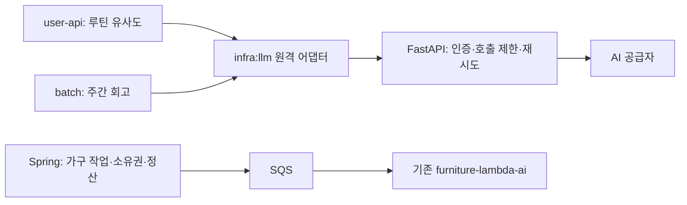

# AI 서버 분리 1단계

임베딩과 텍스트 생성의 공급자 호출을 `ai-service/` FastAPI 프로세스로 분리한다. 같은 저장소에서 계약을 함께 검증하고, 이미지와 프로세스는 Spring과 별도로 배포할 수 있다. `ai.service.enabled`의 기본값은 `false`여서 이 변경만 배포하면 기존 직접 호출 경로가 유지된다. 고객용 API와 DB 스키마는 바뀌지 않는다.

## 책임 경계



| Spring에 유지 | FastAPI로 이동 |
| --- | --- |
| 루틴 정규화·동일 제목 판정·코사인 점수 | 임베딩 공급자 HTTP 호출·응답 순서/차원 검증 |
| 주간 통계·프롬프트·사용자 언어·JSON 결과 검증·DB 저장 | 텍스트 공급자 HTTP 호출 |
| 기존 장애 시 EXACT-only 판정/회고 FALLBACK 정책 | 공급자 재시도·시간/크기/동시 실행 제한 |
| 인증/소유권·보상/정산·가구 작업 수명 주기 | 내부 서비스 토큰 검증 |

FastAPI에는 DB, Redis, SQS, S3 자격 증명이 필요 없다. 주간 기간의 한국 시간 정책과 개인 루틴 알림의 현지 시간 정책도 그대로다. 가구 생성은 이미 Lambda/SQS로 분리되어 있으므로 이번 단계에서는 변경하지 않는다. 해당 경로는 [가구 운영 문서](furniture-service-rollout.md)를 따른다.

## 실행과 검증

Python 3.12 또는 3.13, `uv`, Java 25가 필요하다. Python 의존성은 `ai-service/uv.lock`으로 고정한다.

```bash
uv sync --directory ai-service --frozen
uv run --directory ai-service --frozen pytest -q
./gradlew :infra:llm:test
python3 qa/ai-service-contract/run.py
./gradlew test
git diff --check
```

계약 스크립트는 임시 포트에 FastAPI와 모의 공급자를 기동해 실제 JVM HTTP 요청으로 임베딩 순서·completion 본문·공급자 인증·호출 횟수를 검증하고 종료한다. 실제 공급자 키나 AWS/DB 연결을 사용하지 않는다. 일반 Gradle 실행에서는 이 계약 테스트를 건너뛰고 스크립트 실행 시에만 활성화한다.

로컬 Docker 실행:

```bash
cp deploy/ai-service/.env.example deploy/ai-service/.env
# .env의 두 자격 증명을 실제 값으로 교체한다.
docker compose -f deploy/ai-service/compose.yml up --build -d
curl --fail http://127.0.0.1:8090/health/ready
docker compose -f deploy/ai-service/compose.yml down
```

Compose는 호스트 loopback의 8090 포트만 연다. 비 root, 읽기 전용 파일 시스템, CPU 1개·메모리 512MiB·PID 128개로 제한한다. 이는 시작 설정이며 처리량을 보장하는 측정값이 아니다. Uvicorn worker는 1개, HTTP 동시 연결 제한은 32다. worker/replica를 늘리면 공급자 동시 호출 수도 함께 증가한다.

`/health/live`, `/health/ready`는 프로세스와 설정 초기화 완료를 확인한다. 공급자 키 유효성이나 외부 연결 상태까지 보장하지 않으며 공급자에 유료 요청을 보내지 않는다.

## 연결 설정

AI 프로세스는 `deploy/ai-service/.env.example`의 `AI_*`를 사용한다. 서비스 토큰과 공급자 키는 서로 다른 값으로 생성하고 secret 저장소에서 주입한다. 인증 토큰은 공백 없는 ASCII 32자 이상이어야 한다.

Spring의 `user-api`, `batch`에는 각각 다음 설정을 적용한다. 앱별로 독립 전환이 가능하다.

| Spring 환경변수 | 값/의미 |
| --- | --- |
| `AI_SERVICE_ENABLED` | `true`일 때 두 클라이언트 모두 FastAPI 사용 |
| `AI_SERVICE_BASE_URL` | 내부 서비스 origin, 예: `https://ai.internal.example` |
| `AI_SERVICE_TOKEN` | FastAPI의 동일한 내부 토큰 |
| `AI_SERVICE_TIMEOUT` | 기본 `95s`, 90초 초과~120초 이하 |
| `AI_SERVICE_ALLOW_INSECURE_HTTP` | 기본 `false`; private network HTTP를 운영자가 명시 허용할 때만 `true` |
| `LLM_MODEL` | `AI_CHAT_MODEL`과 같아야 함 |
| `LLM_EMBEDDING_MODEL` | `AI_EMBEDDING_MODEL`과 같아야 함 |
| `LLM_EMBEDDING_DIMENSIONS` | `AI_EMBEDDING_DIMENSIONS`와 같아야 함, 1~3072 |

Spring의 `LLM_MAX_TOKENS`, `LLM_TEMPERATURE`, `LLM_JSON_MODE`, `LLM_REASONING_EFFORT`는 요청 옵션으로 계속 사용한다. remote 모드에서는 `LLM_API_KEY`, `LLM_BASE_URL`, `LLM_TIMEOUT`, `LLM_MAX_RETRIES`를 공급자 호출에 사용하지 않는다. 키 없는 remote 설정도 stub으로 바뀌지 않는다. 내부 토큰/URL/timeout이 잘못되면 기동을 중단한다.

로컬 Spring 프로세스는 `http://127.0.0.1:8090`으로 연결할 수 있다. Spring도 컨테이너면 전용 Docker network에 연결해 서비스 이름으로 접근하도록 배포 구성을 별도로 작성한다. Compose의 loopback 포트를 공인 인터페이스로 확장하지 않는다. 별도 호스트 배포에서는 security group으로 Spring 호스트만 허용하고 TLS 또는 사설망 암호화 경로를 사용한다.

## 내부 HTTP 계약

두 API 모두 `Authorization: Bearer <AI_SERVICE_TOKEN>`, `Content-Type: application/json`이 필요하다. 토큰 확인 후 본문을 읽으며 `/docs`, `/redoc`, `/openapi.json`은 비활성화한다. 임의 공급자 URL이나 다른 모델은 요청으로 선택할 수 없다.

### `POST /internal/v1/embeddings`

```json
{"model":"text-embedding-3-large","dimensions":1024,"inputs":["아침 산책","책 읽기"]}
```

응답은 `{"model":"text-embedding-3-large","vectors":[...]}`이며 입력 순서를 보존한다. 입력은 1~128개, 각 1~2048자다. Java는 128개씩 나눠 요청한다. 차원/개수/중복 index/비유한 숫자를 검증하고 불완전한 벡터는 반환하지 않는다.

### `POST /internal/v1/completions`

```json
{"model":"gpt-5.6-luna","systemPrompt":"...","userPrompt":"...","maxTokens":800,"temperature":null,"jsonMode":true,"reasoningEffort":"low"}
```

응답은 `{"model":"gpt-5.6-luna","content":"..."}`이다. 모델별 응답의 도메인 JSON 검증은 기존 Spring 호출자에게 남긴다. system prompt는 최대 65,536자, user prompt/content는 131,072자, 생성 토큰은 1~4096으로 제한한다.

## 실패·용량·관측

- FastAPI가 공급자 재시도를 소유한다. 기본 2회 재시도(최대 3회 호출), 간격 1/2초. 네트워크 오류·429·5xx만 재시도한다. Spring 어댑터에는 재시도 루프가 없다.
- 공급자 read timeout 기본 30초, 요청 전체 제한 90초, Spring 95초다. HTTPX read timeout은 전체 wall-clock 제한이 아니므로 별도 `asyncio.timeout`으로 재시도/대기를 포함한 총 시간을 제한한다.
- 임베딩과 completion은 각각 기본 2개까지 실행한다. 포화 시 대기열 없이 429를 반환한다. 입력은 최대 512KiB/수신 10초, 공급자 응답은 최대 16MiB다.
- 공급자 요청 전송 후 연결이 끊기면 재시도로 공급자 과금이 중복될 수 있다. 추론 호출에 exactly-once를 보장하지 않는다. DB 결과 저장·재화 정산은 기존 Spring 정책이 담당한다.
- 오류 본문은 고정 `code`만 포함한다. 프롬프트·응답·자격 증명·사용자 ID를 로그에 남기지 않는다. 요청 ID, 작업 종류, HTTP 상태, 처리 시간을 기록하고 `X-Request-Id`를 반환한다.

| HTTP / code | Spring 동작 |
| --- | --- |
| 401/403, `AI_PROVIDER_AUTH_FAILED`, `AI_MODEL_MISMATCH` | `LlmAuthException`; 주간 회고 배치를 중단해 설정 장애가 사용자별 영구 FALLBACK으로 쌓이지 않게 함 |
| 429 / `AI_CAPACITY_EXCEEDED` | 재시도 가능한 `LlmException`; 기존 호출자 폴백 |
| 503 / `AI_PROVIDER_UNAVAILABLE`, 504 / `AI_DEADLINE_EXCEEDED` | 재시도 가능한 `LlmException`; 기존 호출자 폴백 |
| 502 / `AI_INVALID_RESPONSE`, `AI_PROVIDER_REJECTED` | `LlmException`; 기존 호출자 폴백, 공급자 재시도 없음 |
| 413/415/422 | 잘못된 요청으로 `LlmException`; 공급자 호출 없음 |

루틴 유사도는 장애 시 기존 EXACT-only 정책을 유지한다. 주간 회고의 일반 장애는 기존 FALLBACK을 저장하므로, 용량 부족도 저장된 대체 회고를 만들 수 있다. 운영 전환 전 해당 시간대의 동시 실행과 공급자 제한을 확인한다. FastAPI 장애가 나도 직접 공급자로 자동 우회하지 않는다.

## 전환과 복구

1. AI 이미지 배포와 사설 연결·secret 주입을 먼저 준비한다. 현재 변경에는 AWS 리소스 생성, ECR 게시, 운영 전환은 포함되지 않는다.
2. 동일 모델/차원으로 실제 공급자 smoke를 실시한다. health만으로 전환하지 않는다. 호출 시간, 429/5xx, JVM timeout을 관찰한다.
3. `user-api`만 `AI_SERVICE_ENABLED=true`로 전환해 루틴 유사도와 장애 시 EXACT-only 동작을 확인한다.
4. 다음으로 `batch`를 전환한다. 중복 주간 결과 생성 없이 정상 회고/언어/모델 저장과 인증 장애 중단을 확인한다.
5. 문제가 생기면 해당 앱의 `AI_SERVICE_ENABLED=false`로 복구 후 재시작한다. 직접 호출 복구에는 기존 `LLM_API_KEY`와 직접 호출 설정이 필요하므로 초기 관찰 기간에는 이 설정을 유지한다. DB migration은 없다.
6. 안정화 후 Spring의 불필요한 공급자 키를 제거한다. 이후 직접 호출 복구 시에는 키를 다시 주입해야 한다.

실제 공급자 smoke는 `AI_SERVICE_BASE_URL`, `AI_SERVICE_TOKEN`, AI 서버와 같은 `AI_CHAT_MODEL`/`AI_EMBEDDING_MODEL`/`AI_EMBEDDING_DIMENSIONS`를 환경변수로 주입한 다음 `python3 qa/ai-service-contract/smoke.py`로 실행한다. 임베딩 입력 2개와 짧은 completion 1건을 실제 호출하므로 공급자 사용량이 발생한다. HTTP 사설망 배포는 AI 호스트의 localhost에서 실행한다. URL은 배포 설정에서 검증된 내부 주소로 고정하며 토큰을 명령 인수나 출력에 넣지 않는다.

원격 계약은 현재 운영 중인 고정 차원 임베딩을 기준으로 한다. 직접 호출 모드의 `LLM_EMBEDDING_DIMENSIONS=0`(차원 옵션 생략)은 원격 모드에서 지원하지 않는다. 공급자나 모델을 바꾸면 차원·reasoning effort 지원을 먼저 검증한다.

`.github/workflows/ai-service.yml`은 Python·Java·실제 HTTP 계약 테스트와 별도 Docker build를 수행한다. 기존 PR Gate와 Spring 배포 파이프라인은 그대로 유지한다.

## 다음 단계

가구 추론 경로를 옮길지는 기존 Lambda 처리량·비용·재시도/lease/취소 보장을 비교한 뒤 결정한다. 이전 시에도 작업 생성·outbox·소유권·크레딧 정산은 Spring에 둔다. 이 단계의 성공만으로 가구 Lambda 경로 또는 모든 AI 워크로드의 분리가 완료됐다고 간주하지 않는다.

구현 참고: [FastAPI lifespan](https://fastapi.tiangolo.com/advanced/events/), [HTTPX timeout 의미](https://www.python-httpx.org/advanced/timeouts/), [HTTPX connection limits](https://www.python-httpx.org/advanced/resource-limits/).
