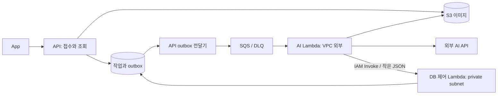

# 가구 생성 Lambda 실행 분리

기존 multipart 경로에서 API는 사진 접수·전처리·S3 업로드와 작업 조회를 맡는다. 업로드 완료 또는 피드백 접수 트랜잭션에서 실행 ID와 outbox를 함께 저장한다. 별도 스케줄러가 `jobId`, `executionId`만 SQS로 전송한다. Lambda는 S3에서 이미지를 읽고 기존 특징 추출·제작 지침·이미지 생성·검수를 수행한다. 2026-09-11에 추가한 [직접 업로드와 vips 전처리 경로](furniture-preprocessing.md)는 기본 비활성화이며 별도 배포 검증이 필요하다.



## 보장하는 경계

- 동일 사진의 단계 순서는 EXTRACT → GENERATE → REVIEW이고 검수 결정에 따라 EDIT/REGENERATE를 반복한다. 기존 시도 횟수 한도를 유지한다. 원본은 추출·검수에만 들어가고 생성에는 전달하지 않는다.
- 전체 동시 실행 수는 DB singleton 잠금으로 제한한다. `execution_mode=RESIDENT`가 기본이며 이 버전의 상주 워커는 LAMBDA 모드에서 작업을 선점하지 못한다.
- SQS가 중복 전달돼도 첫 invocation owner만 실행한다. 단계 결과 저장과 다음 단계 선점을 하나의 트랜잭션에서 처리하므로 그 사이 다른 워커에 실행권이 넘어가지 않는다.
- DB 명령에는 순번과 해시가 있다. 같은 명령 재전송은 마지막 응답을 반환하며, 같은 순번의 다른 내용은 거부한다. AI 호출을 둘러싼 자동 재시도는 없다. 제어 명령만 최대 3회 전송한다. API의 SQS 전송도 전체 5초로 제한해 한 번의 네트워크 정체가 전달·정리 스케줄러를 무기한 붙잡지 않게 한다.
- 결과 저장 여부를 알 수 없는 실행은 새 invocation이 이어서 AI를 호출하지 않는다. 작업 lease가 만료되면 기존 유지보수 작업이 실패 처리하고 생성권을 한 번만 반환한다. 공급자에서 이미 발생한 비용까지 취소되는 것은 아니다.
- 최종 Item/UserItem 생성, 작업 성공, 생성권 정산은 기존 DB 트랜잭션을 공유한다. 사용자 탈퇴·원본 만료·옛 실행 ID·다른 실행의 에셋 경로도 검증한다.
- DB 제어 함수는 AI/S3 빈을 만들지 않으며, `DriverManagerDataSource`로 명령 처리 후 연결을 닫는다. AI 함수는 Spring/JPA 컨텍스트를 기동하지 않는다. 공유 모듈 때문에 ZIP 안에는 일부 미사용 DB 라이브러리가 포함된다.

## 실행 설정과 한계

| 항목 | 초기 배포 구성 |
| --- | --- |
| AI 함수 | Java 25 / arm64 / 2048MB / 600초 / reserved concurrency 2 |
| DB 제어 함수 | Java 25 / arm64 / 1024MB / 60초 / reserved concurrency 2 |
| SQS | batch 1 / maximum concurrency 2 / visibility 3600초 / 실패 5회 후 DLQ |
| DB 실행 lease | 전체 실행 시작부터 660초 |
| 실행 트리거 | 기본 비활성화 |
| 이미지 모델 | Terraform 기본 `gpt-image-2.5-flare`; 기존 API 기본값은 유지 |

SQS visibility를 함수 제한 시간의 6배로 둔 것은 [AWS SQS 연결 문서](https://docs.aws.amazon.com/lambda/latest/dg/services-sqs-configure.html)를 따른다. 같은 문서는 reserved concurrency 5 이상을 권장한다. 이 초기 구성은 비용·실행 수를 보수적으로 제한하려고 maximum concurrency와 reserved concurrency를 모두 2로 맞췄으며, 실제 throttle·큐 대기를 측정해야 한다. Java 25는 [관리형 런타임](https://docs.aws.amazon.com/lambda/latest/dg/lambda-runtimes.html)을 사용한다.

위 메모리·동시성은 실측한 안전 상한이 아니다. 남은 실행 시간이 HTTP 제한 시간(생성은 두 번 호출)과 30초 여유보다 적으면 새 단계를 시작하지 않고 실패·환불한다. SDK 통신, S3 읽기, cold start까지 합친 실행 시간은 AWS에서 별도 검증한다. API 업로드·전처리의 순간 메모리 사용은 남아 있으므로 과도한 업로드 폭주까지 해결됐다는 의미도 아니다.

## 로컬 검증

작업 worktree 루트에서 Java 25를 사용한다.

```bash
./gradlew test :furniture-lambda-ai:buildZip :furniture-lambda-control:buildZip
terraform -chdir=deploy/furniture-lambda init -backend=false
terraform -chdir=deploy/furniture-lambda validate
git diff --check
```

- `FurnitureLambdaIntegrationTest`: 실제 MySQL에서 동시 중복 8개 중 실행 하나, 서로 다른 작업의 전체 상한 2, 매 단계 커밋 응답 유실, 미확정 결과의 만료·단일 환불, outbox 전송 재시도/rollback, 시간 예산, 실행별 S3 경로, 실제 이미지 처리와 피드백 실행 분리, 탈퇴 fencing을 검증한다. 외부 AI·S3는 fake이다.
- `AiHandlerTest`: 단일 SQS 배치, 포화 시 부분 실패, 중복 ACK, 고정된 명령만 재전송함을 검증한다.
- `ControlBootTest`: MySQL migration/validate와 DB 제어 전용 부트를 실행하고 AI/S3 빈 및 유휴 커넥션 풀이 없음을 확인한다.
- 로컬 테스트는 AWS IAM, Linux 이미지 처리 라이브러리, Lambda cold start, 실제 provider 제한·비용 검증을 대신하지 않는다.

## 배포 순서

1. 기존 상주 워커 변경을 포함한 이 worktree를 리뷰하고 최신 migration 번호와 충돌 여부를 확인한다. V69/V70은 아직 운영 적용 전이다.
2. AWS에서 암호화·접근 제한한 Terraform remote state backend를 먼저 구성한다. `db_password`는 sensitive지만 Terraform state에는 값이 저장된다. 로컬 state/plan/tfvars를 공유하거나 커밋하지 않는다. CI secret 또는 임시 환경 주입을 사용한다. DB URL에는 비밀번호를 넣지 않는다.
3. `deploy/furniture-lambda/main.tf`에 필요한 기존 VPC/private subnet/RDS SG/에셋 bucket/비공개 배포 artifact bucket/publisher IAM role/SSM key ARN/KMS ARN/SNS alarm topic을 입력해 plan을 검토한다. 현재 배포 정의는 NAT나 VPC endpoint를 만들지 않는다. AI 키는 VPC 외부 함수가 SSM에서 읽고 DB 함수에는 DB 정보만 전달한다.
4. V69/V70 적용과 새 API 배포는 dispatcher 비활성화 상태에서 수행한다. 두 ZIP은 기존 비공개 artifact bucket을 통해 배포하며 트리거도 끈 상태로 만든다. 이 구성을 적용하기 전 환경·비용·plan을 승인한다.
5. 구버전 워커를 종료하고 진행/대기/업로드 작업을 비운다. `switch-mode.sql`의 조회로 drain을 확인한 뒤 DB 모드를 LAMBDA, 전역 상한을 2로 전환한다. API 환경에 `FURNITURE_LAMBDA_DISPATCH_ENABLED=true`, `FURNITURE_LAMBDA_QUEUE_URL=<output>`를 설정하고 SQS 트리거를 활성화한다. 사용자 접수는 이 전환이 끝난 뒤 재개한다.
6. 운영 트래픽 전에 제한된 DEV 검증을 한다. 처음에는 fake AI로 연결/장애를 확인하고, 승인된 실제 이미지 소량으로 출력·소요 시간·Max Memory Used·일반 API p95·오류/환불·큐 대기·비용을 기록한다. 이 검증 전에는 운영 완료/성능 향상 수치를 주장하지 않는다.

되돌릴 때는 트리거와 dispatcher를 끄고 RUNNING 실행을 완료 또는 lease 만료로 정산한 다음 모드를 RESIDENT로 바꾼다. 큐에 남은 옛 메시지는 실행 ID와 상태로 fencing되지만, 이미 호출한 유료 AI 작업을 초기 상태로 되돌려 재생하지 않는다. pending outbox가 없는 전환 이전 QUEUED 작업은 drain 후 전환한다.

## 정리와 관측

API 유지보수는 dispatcher 기능과 함께 매분 실행되어 lease 만료·탈퇴·24시간 사진 삭제를 처리한다. 실행 응답에 포함된 특징/키도 같은 보존 기한에 삭제한다. 성공한 공개 에셋은 보관함이 참조하므로 유지한다. 이전 후보와 DB 저장 전 중단된 private 업로드는 기존 bucket의 private prefix 수명주기 정책으로 정리해야 한다. **기존 S3 lifecycle 설정은 이 Terraform이 덮어쓰지 않는다.** 배포 전 private prefix 1일 만료 및 버전 관리 시 noncurrent version 정책을 확인한다.

공개 결과 업로드 후 DB 정산 전 중단된 경우에는 미연결 공개 에셋이 남을 수 있다. 공개 prefix 전체에 만료 정책을 적용하면 정상 가구도 삭제되므로 적용하지 않는다. 배포 전 정기 S3 inventory와 DB `referencesAsset` 대조 절차를 정하고, 미연결·유예 기간 경과가 확인된 객체만 정리한다. 이는 기존 worker에도 있는 정리 한계다.

Terraform은 DLQ 메시지와 큐 최장 대기 시간에 대한 SNS 알람을 구성한다. 추가로 함수 Errors/Throttles/Duration/Max Memory Used, API outbox 전송 실패, QUEUED 대기 시간, WORKER_INTERRUPTED/환불 건수를 확인한다. DB/외부 AI가 멈춘 상황에서는 큐 대기가 증가하고 SQS 재전달이 visibility 때문에 늦어질 수 있다. 무제한 재시도·동시성 증가 대신 원인을 확인하고 실행 상한과 provider 한도를 함께 조정한다.

현재 재사용 경계는 작은 실행 명령, outbox, 실행 소유권, 제어 호출 구조다. 새 AI 기능은 별도 큐와 동시성/시간/시도 예산을 부여한다. 가구 도메인 정산 코드를 범용 AI 플랫폼으로 추상화하지 않았다.

## 2026-09-09 검증 결과

구현 검증 시점의 `./gradlew test` 및 두 ZIP 빌드가 통과했다. XML 집계는 총 1951개 중 1948개 통과, 실제 AI 호출 테스트 3개 제외, 실패·오류 0개다. `terraform validate`, `terraform fmt -check`, `git diff --check`도 통과했다. 재현 로그·테스트 집계·ZIP SHA-256은 `output/reviews/furniture-lambda-implementation-20260909/validation.json`과 `verified.log`에 보관했다.

이후 실제 DEV 전용 스키마·S3·SQS·Lambda로 두 건을 실행해 모두 성공했다. 접수는 로컬 application service이며 기존 DEV API 배포는 변경하지 않았다. 큐 실행 허용 후 완료는 46.9초/69.9초, AI Lambda Max Memory Used는 297MB/288MB, 실제 동시 실행 2였다. 제어 함수 최대 712MB와 새 환경 handler 30.8초를 관측해 초기화 비용이 후속 개선 후보로 남았다. 최종 트리거·DB 실행 허용은 껐고 전용 큐가 비었으며 SSM 터널을 닫았다. 상세 근거는 원 저장소의 `output/reviews/furniture-lambda-dev-20260909/README.md`에 보관했다. 같은 조건의 AWS A/B/C 부하·장애 주입·운영 적용은 여전히 미완료다.

## 2026-09-09 접수 및 호출 안정화

`furniture.admission.max-uploads=2`는 API 프로세스별 multipart 이전 접수를 제한한다. `max-outstanding=40`은 DB에 남은 UPLOADING/QUEUED/PROCESSING 합계의 전역 상한이며 복제본 간 같은 설정이 필요하다. `max-queue-wait=5m`은 QUEUED 대기를 제한한다. 초과·만료·DB 잠금 실패의 코드와 환불은 통합 테스트로 검증했다. 기존 DEV API에는 아직 배포하지 않았다.

AI→제어 Lambda SDK의 socket/attempt timeout은 63초, 전체 호출은 65초로 제어 함수의 60초 제한보다 길게 설정했다. 31초 지연 HTTP 테스트에서 요청 1회 성공, 최종 DEV 완료 작업 확인에서 AI/제어 호출 각각 1회를 관찰했다. 큐 나이 알람은 120초·60초 기간 1회로 변경했으며 테스트 알람 수신자는 없다. 전체 Gradle 검증은 1,961개 중 1,956 통과·5 skip·실패 0이다. 루트 작업 폴더의 `output/benchmarks/furniture-stability-20260909-v2/README.md`에 부하 조건·결과·한계를 기록했다.
