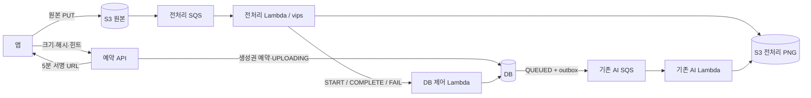

# 가구 사진 직접 업로드와 vips 전처리

2026-09-11 구현. 기존 가구 워커 worktree에 직접 업로드 API, 전처리 Lambda, DB 완료 처리를 연결했다. 기능 플래그는 기본 비활성화이며 이 구현을 AWS/DEV API에 배포하지 않았다. 기존 multipart 접수 경로는 남아 있다. 클라이언트가 새 경로를 사용해야 API에서 원본 사진 디코딩과 업로드가 빠진다.



## API 계약

`FURNITURE_UPLOAD_ENABLED=true`인 API에서 인증된 사용자만 아래 경로를 호출한다. 기존 `furniture.generation.enabled`도 활성화돼 있어야 한다.

`POST /api/v1/me/furniture-generations/uploads`

```json
{
  "requestId": "9d162b95-d393-4560-95b6-3c3bec1ed93d",
  "sha256": "원본 파일 바이트의 SHA-256 소문자 64자리",
  "bytes": 123456,
  "contentType": "image/jpeg",
  "targetHint": "앞쪽 의자"
}
```

- 파일은 JPEG/PNG, 1바이트~10MiB. API가 이미지 바이트를 받지 않는다.
- `202 Accepted`와 `Location: /api/v1/me/furniture-generations/{id}`, `Cache-Control: no-store`를 반환한다.
- 응답 필드는 `job`(기존 작업 조회 DTO), `uploadUrl`, `headers`, `uploadUrlExpiresAt`이다. `job.status`는 초기 `UPLOADING`이다.
- 앱은 URL에 원본 바이트를 **그대로 PUT**한다. multipart/form-data로 감싸지 않는다. 응답의 서명 헤더와 원본을 유지해야 한다. `Content-Length`는 실제 전송 길이와 같아야 한다.
- `Content-Type`, `Content-Length`, `x-amz-checksum-sha256`, `If-None-Match: *`를 서명한다. 임의 내용 변경과 기존 키 덮어쓰기를 제한한다. 서명 URL·헤더는 요청 로그/분석 이벤트에 남기지 않는다.
- PUT 응답 유실 후 같은 원본 재전송은 `412`일 수 있다. 새 작업으로 재접수하지 않고 기존 작업을 조회한다. 잘못된 헤더/본문으로 생긴 실패를 `412`와 혼동하지 않는다.
- 같은 사용자·requestId·내용은 같은 작업과 생성권 예약을 사용한다. 업로드 전 서명 URL 만료 시 같은 요청으로 재발급할 수 있다. 내용 변경은 `FURNITURE_REQUEST_CONFLICT`다. 이미 업로드 처리를 마쳤으면 `uploadUrl=null`, `headers={}`이다.
- 전체 업로드·전처리 완료 기한은 예약 후 30분이다. 만료 시 생성권을 반환한다. 서명 생성이 일시 실패해도 기존 예약을 재사용하며, 계속 완료되지 않은 예약은 이 기한에 정리된다. URL 한 번의 유효 기간은 최대 5분이다.
- 완료 상태는 기존 GET/list로 확인한다. 앱이 임의의 S3 키를 전달하는 완료 API는 없다.

신규 계약은 서버 worktree에 구현한 상태다. `rougether-spec`에서 별도 직접 업로드 계약을 찾지 못했으며 spec 반영·클라이언트 적용은 배포 전에 조율한다.

## 원본과 출력의 소유권

원본 키는 `private/furniture-generation/raw/{jobId}`, 전처리 출력은 `private/furniture-generation/{jobId}/source/preprocessed.png`로 서버가 정한다. **S3 버전 관리가 활성화된 일반 버킷이 필수**다.

1. 전처리 Lambda가 START 명령을 보낸다. DB는 사용자→작업 순서로 잠근 뒤 업로드 기한·탈퇴·키를 확인하고 원본의 versionId를 고정한다. 다른 버전의 뒤늦은 이벤트는 STALE로 종료한다.
2. Lambda는 그 버전을 지정해 읽고 예약된 바이트 수·Content-Type·SHA-256을 확인한다. 크기가 맞지 않는 응답은 스트림을 abort하여 거대한 본문을 계속 읽지 않는다.
3. vips가 회전·축소·PNG 인코딩한다. 출력은 조건부 PUT으로 한 번 저장한다. source-version, job-id, 원본 해시, PNG 해시를 메타데이터에 붙이고 S3 SHA-256 체크섬도 전송한다.
4. HEAD로 출력 버전·소유권·S3 체크섬을 확인한 뒤 COMPLETE를 보낸다. DB는 `UPLOADING → QUEUED` 전이와 AI 실행 outbox를 **같은 트랜잭션**에 저장한다. 중복 COMPLETE는 새 실행을 만들지 않는다.

같은 S3 이벤트가 동시에 실행되면 이미지 변환 자체는 중복될 수 있다. 출력의 조건부 PUT과 DB 잠금이 중복 저장·중복 AI 등록·중복 정산을 막는다. PUT 또는 COMPLETE 응답이 유실되면 재전달에서 기존 출력을 HEAD로 검증해 이어간다. 소유권이 다른 출력은 덮어쓰지 않는다.

잘못된 이미지/원본 불일치는 FAIL로 환불한다. S3/DB 일시 실패는 SQS 재전달 대상이며 즉시 영구 실패로 분류하지 않는다. 완료 뒤의 FAIL, 만료·탈퇴 뒤의 COMPLETE는 이미 확정된 상태를 되돌리지 않는다. 동기 S3/AI 호출 중 DB 트랜잭션을 유지하지 않는다.

## 메모리 경계와 이미지 처리

`furniture-preprocessing`은 API의 runtime dependency에 포함되지 않는다. 새 `furniture-lambda-preprocess`에서만 네이티브 라이브러리를 로드한다. AI HTTP 호출은 계속 동기이며, Arena lease/handshake 실험은 도입하지 않았다.

```text
원본 byte[] → 처리용 Arena: libvips 이미지·인코딩 PNG
                                │ PNG 한 번 복사
                                ▼
                          출력용 Arena: PNG
처리용 Arena close              │ 동기 S3 PUT / SDK 재시도
                                ▼
                          출력용 Arena close
```

출력은 `PreparedPhoto`가 소유한다. SDK가 재시도할 때마다 독립된 InputStream을 처음부터 제공하고 동기 PUT 종료 후 try-with-resources로 닫는다. 스트림을 닫는 것과 PNG 소유권을 종료하는 것은 구분한다. 원본 byte[]와 SDK 내부 버퍼까지 없어지는 구조는 아니다.

- vips-ffm `1.9.8`, libvips `8.18.6`, `VIPS_CONCURRENCY=1`, 엔진 cache 메모리 50MiB.
- 각 변 32~8192, 최대 32M 픽셀, JPEG/PNG만 허용한다. 다중 페이지와 손상 입력은 거절한다.
- EXIF autorot, 기존 올림 샘플 규칙에 맞춰 긴 변 1536 이하, JPEG shrink-on-load 및 Lanczos3를 사용한다.
- 출력 PNG는 알파를 보존하고 메타데이터를 제거한다. 전처리 원본은 **가로세로 비율을 유지하는 이미지**이며 최종 생성 에셋의 1024×1024 규격과 구분한다.
- 네이티브 출력 포인터를 처리 Arena에 즉시 묶은 후 별도 출력 Arena로 복사한다. vips-ffm #236 수정이 포함된 배포판을 확인하기 전까지 1.9.8의 원본 포인터를 외부로 노출하지 않는다.
- 후보/최종 이미지 기술 검사는 기존 ImageIO 경로를 유지한다. 모든 ImageIO 사용을 대체한 변경은 아니다.

## 빌드와 로컬 재현

Java 25 및 Linux ARM64용 `@img/sharp-libvips-linux-arm64@1.3.3` 패키지가 필요하다. `lib/` 옆 `README.md`, `package.json`, `versions.json`까지 보관한다. ZIP 빌드는 바이너리 SHA-256을 아래 값과 대조하며 라이선스·버전 자료도 함께 넣는다. 개인 사진과 네이티브 바이너리는 커밋하지 않는다.

```text
libvips-cpp.so.8.18.6
SHA-256: 264d3092d69de80f5acdb71c930efec8db5bd9627f41659ed3416566b9ae34b4
```

```bash
./gradlew test :furniture-lambda-control:buildZip :furniture-lambda-preprocess:buildZip \
  -PvipsNativeDir=/absolute/path/to/sharp-libvips-linux-arm64/lib --no-daemon
python3 qa/furniture-preprocess/run_native.py \
  --fixtures /absolute/path/to/fixtures --output output/preprocess-native \
  --java-home /absolute/path/to/jdk25
terraform -chdir=deploy/furniture-lambda fmt -check
terraform -chdir=deploy/furniture-lambda validate
git diff --check
```

`run_native.py`는 배포 ZIP을 풀어 Linux ARM64 컨테이너에서 네트워크를 끄고 실행한다. 컨테이너 한도는 메모리 512MiB·CPU 2, JVM heap 128MiB다. fixture 디렉터리는 `mac-mini.jpg`, `bear-cake.jpg`, `orientation-1.jpg`~`orientation-8.jpg`, `alpha.png`를 준비한다. 사적 사진을 저장소에 추가하지 않는다. 결과 디렉터리에 PNG, JSON 결과, ZIP/네이티브 해시, 실행 로그를 남긴다.

## 배포 구성과 확인할 항목

`deploy/furniture-lambda/preprocess.tf`의 `enable_preprocessing`은 기본 false다. 활성화 시 전처리 Lambda는 Java 25/arm64, 1024MiB, heap 512MiB, timeout 180초, reserved concurrency 2다. SQS batch 1, maximum concurrency 2, visibility 1080초, 최대 수신 2회로 구성했다. 정상적인 첫 수신 후 18분에 재전달돼도 30분 DB 기한 안에서 한 번 재시도할 수 있다. 장시간 큐 정체·스로틀이 생기면 기한을 넘길 수 있으며 그 작업은 환불한다. 이 값은 부하 검증으로 확정한 안전 상한이 아니다.

visibility는 [AWS 문서의 함수 timeout 6배 권장](https://docs.aws.amazon.com/lambda/latest/dg/services-sqs-configure.html)을 반영했다. 같은 문서는 reserved concurrency 5 이상을 권장한다. 비용을 제한하려고 초기에는 reserved/maximum을 모두 2로 맞췄으므로 DEV에서 throttle과 대기를 확인해야 한다.

기존 S3 notification 전체를 이 Terraform이 덮어쓰지 않는다. output `preprocess_notification`의 단일 항목을 버킷의 기존 IaC 설정에 병합해야 한다. 원본 prefix `private/furniture-generation/raw/`의 `ObjectCreated:Put`만 전처리 큐에 연결한다. API 플래그를 켜기 전에 트리거를 실제 검증해야 한다.

- 에셋 버킷 versioning, 비공개 raw/processed prefix, 웹 클라이언트 사용 시 PUT 서명 헤더에 맞는 S3 CORS가 필요하다.
- HEAD에서 미생성 출력의 404를 권한 오류 403과 구분하도록 Lambda에 ListBucket을 부여했다. 이미지 Get 권한은 해당 prefix로 제한한다. [AWS HeadObject 권한](https://docs.aws.amazon.com/AmazonS3/latest/API/API_HeadObject.html)
- 현재 새 IAM 정책은 SSE-S3 기준이다. SSE-KMS 버킷이면 원본 서명 주체와 전처리 Lambda에 해당 키의 GenerateDataKey/Decrypt 및 키 정책을 먼저 검토한다.
- API 유지보수 스케줄러가 실행돼야 만료 환불과 키 정리가 진행된다. LAMBDA 모드에서는 기존 `FURNITURE_LAMBDA_DISPATCH_ENABLED=true`도 필요하다.
- 버전 관리 버킷의 단순 DELETE는 영구 삭제가 아니다. private prefix lifecycle의 current/noncurrent version 삭제와 고아 출력 정리를 확인한다. 탈퇴 뒤 진행 중이던 업로드가 늦게 생성한 객체도 lifecycle 대상이다.
- DLQ와 queue age SNS 알람을 구성했다. 실제 수신 연결 및 Lambda Errors/Throttles/Duration/Max Memory Used, DB 제어 지연, 일반 API p95, 실패·환불·큐 대기를 DEV에서 검증한다.
- 롤백은 새 접수 플래그를 끄고 이미 예약된 업로드가 완료/만료되도록 전처리 트리거·유지보수를 유지한다. 큐/DB를 일괄 초기화하거나 이미 수행한 AI를 다시 호출하지 않는다. 기존 클라이언트의 multipart 경로는 계속 API에서 전처리한다.

## 마이그레이션 충돌 — 배포 전 해결 필요

2026-09-11에 fetch한 `origin/main=d08dcad6` 기준이다. 이 worktree의 기존 V69(워커 용량), V70(Lambda outbox)는 DEV 전용 실험 스키마에서 사용한 이력이 있다. main에는 V69 알림 삭제와 V69 방 성장 파일이 동시에 있고 V70 방 성장 최고 레벨이 있다. 이번에 추가한 V71은 아직 외부 DB에 적용하지 않았다.

main 자체의 중복 V69와 worktree의 V69/V70 충돌을 먼저 조율하고, 대상 환경의 `flyway_schema_history`와 실제 스키마를 대조해야 한다. 이미 적용한 migration 파일을 단순 개명/수정하거나 flyway repair로 덮지 않는다. 이번 로컬 검증은 worktree 단독 migration 이력에서 실행했으므로 main 병합·DEV 배포 준비가 끝났다는 근거로 사용하지 않는다.

## 검증 기록

개별 MySQL 테스트에서 직접 예약/중복 완료/만료/탈퇴/기존 AI 정산 연결을 검증했다. AI 응답은 fake이며 실제 비용은 발생하지 않았다. 핸들러 테스트는 SQS 부분 실패 응답, TestEvent, 남은 시간 확인을 다룬다. S3 mock 테스트는 PUT·DB 응답 유실, 체크섬 불일치, 초과 응답 abort, 동기 SDK 재읽기와 PNG close를 다룬다. 실제 AWS IAM/이벤트 전달을 검증한 결과로 해석하지 않는다.

`output/preprocess-integration-native/`에서 배포 ZIP으로 11개 fixture의 PNG를 생성해 기존 별도 Arena 실험 출력과 SHA-256이 모두 같음을 확인했다. 추가 알파·수명 반복 40회, 잘못된 입력 4종도 통과했다. 이는 기능 통합 검증이며 장시간 메모리 안정성이나 처리량 개선의 새 측정은 아니다. 전체 회귀 결과는 `output/preprocess-integration-gradle.log`와 `output/preprocess-integration-validation.json`에 기록한다.

최종 `./gradlew test`와 전처리/제어 ZIP 빌드는 통과했다. 전체 JUnit XML 집계는 **1,993개 중 1,986 통과·7 제외·실패/오류 0**이다. 제외는 실제 외부 호출용 5개와 로컬 `VIPS_NATIVE_PATH` 조건의 2개이며, 네이티브 동작은 위 Linux ZIP probe로 별도 확인했다. `terraform validate`, `terraform fmt -check`, `git diff --check`도 통과했다. 최종 테스트 후 새 Testcontainers 컨테이너는 종료됐다.
