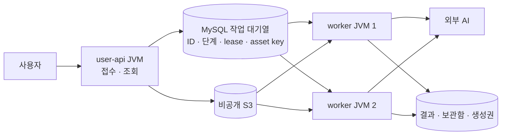

# 가구 생성 상주 워커

## 실행 경계

`user-api`는 사진 접수·전처리·S3 저장·DB 예약·조회·피드백을 담당한다. 기존 가구 스케줄러를 제거했으며, 과거 `FURNITURE_GENERATION_WORKER_ENABLED=true`를 전달해도 API에서 가구 작업을 실행하지 않는다. 접수 가능 여부는 `furniture.generation.enabled`로 판단한다. 워커 전용 AI 키가 API에 없어도 접수할 수 있다.

`furniture-worker`는 HTTP 포트를 열지 않는 별도 Spring Boot 앱이다. `EXTRACT → GENERATE → REVIEW`와 EDIT/REGENERATE, 후보 검사·저장·보관함 지급·생성권 정산·만료 정리를 담당한다. API와 같은 JVM이나 executor를 공유하지 않는다. 별도 컨테이너가 같은 호스트에서 실행되면 호스트 RAM·CPU·디스크는 여전히 공유한다.



## 모듈

- `furniture-application`: 생성 AI 클라이언트·전처리/검사·작업 트랜잭션·단계 실행·생성권 예약/정산 원장. 독립 Boot 앱에 의존하지 않는 공유 애플리케이션 라이브러리다.
- `infra:assets`: 기존 사용자 S3 저장소를 그대로 이동한 공유 어댑터다. API와 워커에서 같은 key·삭제 규칙을 적용한다.
- `furniture-worker`: 비웹 부팅·설정·소비 루프와 종료 제어만 담당한다.
- `domain`: 기존 Entity/Repository와 새 실행 용량 행, Flyway migration의 단일 소스다.
- `common`: 공유 오류 코드. AuthErrorCode·BillingErrorCode의 package를 이동했으며 code/message/status는 유지한다.

생성권 결제 검증·구매/환불 처리는 user-api에 유지한다. 가구 예약·정산만 GenerationCreditLedger로 추출했고 기존 결제 서비스는 위임한다. 사용자 행 잠금, MANDATORY 트랜잭션, 예약 상태 및 보관함 지급과의 원자성을 유지한다.

## 병렬 실행과 대기열

새 큐 서버 없이 기존 `furniture_generation_jobs`를 사용한다. 메모리에는 실행 중인 작업만 올리며, 나머지는 DB 행으로 대기한다. 각 워커의 고정 개수 소비 루프가 한 단계씩 선점한다. 같은 작업은 기존 lease token과 상태 검사로 중복 선점을 막는다.

`V69__add_furniture_worker_capacity.sql`은 singleton 행 `furniture_worker_capacity`를 만든다. 기본 `max_in_flight=1`, `execution_enabled=true`다. 워커 로컬 수는 `FURNITURE_WORKER_CONCURRENCY`이며 기본 1, 기동 검증 범위 1~40이다. 이는 안전 병렬수 40을 뜻하지 않는다.

선점 트랜잭션의 순서는 **용량 행 잠금 → 현재 PROCESSING 수 확인 → 사용자 잠금 → 작업 잠금/선점**이다. 선점은 READ_COMMITTED로 직전에 커밋된 실행 수를 읽는다. 실제 상태를 세므로 별도 증가/감소 카운터의 복구가 필요 없다. 외부 AI/S3 호출 전에 선점 트랜잭션과 잠금을 끝낸다.

두 JVM에 로컬 루프 4개씩 있어도 DB 상한이 4라면 합계 실행은 최대 4개다. 상한을 낮춰도 진행 중 작업을 취소하지 않고, 실행 수가 새 상한보다 줄어들 때까지 신규 선점을 보류한다. 실행을 일시 정지하면 새 작업 선점만 멈추고 예약·대기열은 유지한다. 정리는 별도 루프가 수행한다.

운영자가 변경할 때 사용할 SQL 형식은 다음과 같다. 테스트에서 4개를 사용했지만 운영 기본값을 자동으로 4로 올리지는 않는다.

```sql
UPDATE furniture_worker_capacity SET max_in_flight = 4 WHERE id = 1;
UPDATE furniture_worker_capacity SET execution_enabled = FALSE WHERE id = 1;
UPDATE furniture_worker_capacity SET execution_enabled = TRUE WHERE id = 1;
```

## 종료·장애·정산

종료 신호를 받으면 주기 실행을 중지하고 진행 중 단계를 기본 270초 기다린다. 앱 종료 phase timeout은 300초, compose stop grace도 300초다. 시작한 유료 요청을 정상 종료 중 무조건 취소하지 않는다. 제한 시간을 넘기면 interrupt 후 종료하며, 강제 종료 시 미완료 PROCESSING 행을 남긴다.

기존 정책대로 외부 호출 결과가 불확실한 작업은 자동 재전송하지 않는다. lease는 현재 AI timeout+60초이며, 만료 정리는 `WORKER_INTERRUPTED`로 실패 처리하고 예약을 한 번 해제한다. 늦게 도착한 결과는 lease fencing으로 거부한다. OOM 후 워커를 재시작해도 QUEUED 작업은 남아 처리할 수 있다.

DB 상한은 애플리케이션의 PROCESSING 단계 수에 대한 한도다. timeout 뒤 공급자가 계속 계산하는 경우까지 공급자 내부 실행 수를 보장하지는 않는다. DB가 끊기면 다음 선점을 하지 못하고, 진행 중 결과 저장 실패는 기존 lease 만료 정책으로 수습한다.

## 배포 준비와 전환

이번 작업은 로컬 검증까지이며 운영 배포와 신규 AWS 리소스 생성은 수행하지 않는다. 준비된 실행 템플릿은 `deploy/furniture-worker/compose.yml`이다. 운영 DB/S3 접근 권한·비공개 네트워크·환경 파일은 배포 환경에서 공급한다.

```bash
docker build --build-arg APP_MODULE=furniture-worker -t <worker-image> .
```

주요 환경 변수:

| 변수 | 용도 |
| --- | --- |
| SPRING_DATASOURCE_URL / USERNAME / PASSWORD | API와 같은 작업 DB |
| ASSET_S3_BUCKET / ASSET_S3_REGION | 기존 비공개 원본과 결과 저장소 |
| LLM_API_KEY / LLM_BASE_URL | 워커의 AI 접근 |
| FURNITURE_GENERATION_STYLE_REFERENCE_KEYS | API와 동일한 참고 에셋 |
| FURNITURE_WORKER_CONCURRENCY | JVM당 소비 루프 수 |
| BILLING_REQUIRE_CREDITS | 신규 예약 정책. 이미 예약된 작업은 설정과 무관하게 정산 |

worker는 Flyway를 실행하지 않는다. API의 migration 적용 후 worker를 시작한다. 최초 전환에서는 신규 접수를 잠시 닫고, 기존 API 내 워커를 drain/중지한 다음 새 API와 워커를 시작한다. **기존 버전 워커는 전역 용량 잠금을 사용하지 않으므로 신구 워커를 동시에 실행하지 않는다.** 롤백도 새 워커를 정지한 후 이전 실행 방식 하나만 활성화한다. 적용된 migration은 유지한다.

compose의 512MiB 힙/1024MiB 컨테이너는 워커 초기 실행 설정이다. 호스트 예산에는 API, 워커 개수, DB, OS 및 배포 중 신구 프로세스 중첩을 함께 포함해야 한다. 별도 JVM의 기본 메모리 비용은 늘어나므로 단순히 같은 작은 EC2에 추가하면 안 된다. 배포 전 실제 호스트 여유를 확인한다.

## 검증 범위와 남은 비교

- 기존 가구/생성권/소유권/원본 파기 계약을 회귀 검증한다.
- 동시 선점 8개가 DB 상한 2개를 넘지 않고, 단계 종료/lease 실패 후 자리가 돌아오는지 확인한다.
- 실행 pause/resume, 로컬 루프 상한, 종료 drain을 검증한다.
- 실제 API JVM 1개 + worker JVM 2개에서 20개 접수·전역 4개 실행·정산을 측정한다.
- worker OOM 후 API 응답, lease 만료 처리, 생성권 해제 및 반복 재시작의 중복 정산 방지를 측정한다. 시험에서는 대기 시간만 줄이기 위해 테스트 DB의 lease를 과거로 바꿨음을 기록한다.

실제 AI·S3 네트워크·운영 호스트·업로드 폭주·여러 종류의 일반 API 혼합 부하와 장시간 soak는 별도 검증 대상이다. worker 분리로 API의 업로드/전처리 메모리까지 없어지지는 않는다. 이 실측값으로 상주 워커의 기본 비용과 장애 격리 효과를 남긴 뒤 Lambda를 같은 조건과 비용 모델로 비교한다.

## 검증 결과와 Lambda 비교 기준

2026-09-09 로컬 검증에서 워커 2개·전역 상한 4개로 20건을 모두 완료했다. 별도 장애 주입에서는 워커의 JVM heap OOM 후에도 인증된 가구 목록 API 오류가 없었으며, 19건 예약 해제와 대기 단계 1건 완료를 확인했다. 재시작을 반복해도 원장에 추가 정산이 생기지 않았다. 전체 회귀 테스트는 1,934개 통과, 실제 AI smoke 1개 제외였고 API/worker bootJar 빌드도 성공했다. 가짜 AI와 파일 저장소를 사용한 격리 환경의 결과이며 운영 성능 수치는 아니다.

다음 비교 대상은 **일반 on-demand Lambda Functions**다. Lambda Managed Instances나 Provisioned Concurrency는 요금 구조가 다르므로 같은 계산에 섞지 않는다. 일반 함수는 요청 수와 할당 메모리·실행 시간에 따라 과금된다. 따라서 함수 안에서 AI HTTP 응답을 기다리는 시간도 실행 시간에 포함되는 구조로 비용을 추정해야 한다. 호출이 드문 경우와 지속적인 부하를 각각 계산하고, 실제 측정 없이 Lambda가 더 저렴하다고 결론 내리지 않는다. [AWS Lambda 요금](https://aws.amazon.com/lambda/pricing/)

| 비교 항목 | 상주 워커 현재 구현 | Lambda에서 추가 확인할 것 |
| --- | --- | --- |
| 실행 구조 | JVM을 유지하고 제한된 작업들을 병렬 실행 | 초기화 시간, 함수당 메모리, 호출 단위 |
| 비용 | 상주 호스트 비용과 유휴 메모리 | 할당 GB × 과금 초의 합계, 요청·큐·네트워크 비용 |
| 대기열 | DB 행 선점과 lease | SQS 도입 시 DB 작업 생성과 메시지 전달의 원자성, outbox 등 전달 보장 |
| 중복/장애 | 단계 fencing, 예약 원장, 불확실한 유료 호출은 실패 정산 | 중복 메시지가 AI 재과금이나 중복 지급으로 이어지지 않는지 |
| 확장 한계 | 전역 동시 실행 상한과 호스트 자원 | DB 연결 예산, 공급자 한도, 동시 실행 상한 |

SQS 연동은 중복 전달이 가능하므로 같은 job ID를 여러 번 받아도 안전해야 한다. 기존 lease/원장은 재사용할 수 있지만, 메시지 처리 성공/실패와 부분 배치 응답의 연결은 별도 구현·검증이 필요하다. [AWS SQS 연동](https://docs.aws.amazon.com/lambda/latest/dg/with-sqs.html)

일반 Lambda 함수의 실행 제한은 15분이다. 단계별 함수인지 전체 작업 함수인지 먼저 정하고, 외부 호출 timeout·초기화·저장 시간을 포함한 예산으로 검사한다. 현재의 상주 워커 측정만으로 Lambda의 처리 시간·비용·안정성이 검증된 것은 아니다. [AWS 실행 한도](https://docs.aws.amazon.com/lambda/latest/dg/gettingstarted-limits.html)
