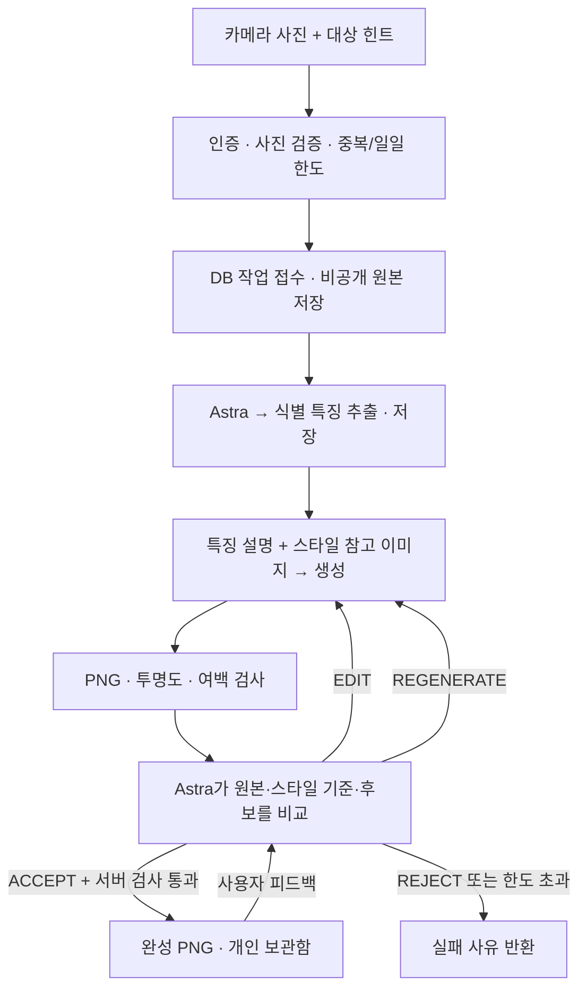

# 사진으로 내 가구 만들기 — 서버 구현 계약

카메라 사진에서 가구 하나를 골라 Rougether 스타일의 투명 PNG로 만들고 개인 보관함에 지급합니다. Astra가 생성 도구를 호출하고 별도의 이미지 검수에서 유지·부분 수정·전체 재생성·거절을 판단합니다. 사용자 피드백도 먼저 검수에 전달합니다.

신규 API의 구현 계약이며 `rougether-spec` 동기화 대상입니다. 기존 상점·보관함·방 배치 계약은 유지합니다. 관리자 Asset Foundry의 수동 승인 상태와 별개로 동작합니다. 기본 설정은 비활성이며 이 변경 자체로 운영 기능이 켜지지 않습니다.



## 입력과 결과

- 입력: 실제로 디코딩 가능한 JPEG/PNG, 최대 10MiB, 가로·세로 32~8192px, 총 3,200만 픽셀 이하. HEIC는 모바일에서 JPEG/PNG로 변환해 전송해야 합니다.
- 카메라 JPEG의 EXIF 회전/반전을 적용하고 최대 변 1536px 이하로 축소합니다. PNG로 재인코딩해 EXIF·GPS·텍스트 metadata를 제거한 사본만 보관하고 모델로 전송합니다.
- 한 사진당 가구 하나를 만듭니다. `targetHint`가 없으면 가장 두드러진 앞쪽 가구를 선택하도록 요청합니다. 원본에 가구가 없거나 구분할 수 없으면 검수에서 거절할 수 있습니다.
- 업로드 후 `EXTRACT` 단계에서 Astra가 원본 사진을 보고 종류·특징적인 부품·부품별 색상 계열을 엄격한 JSON으로 한 번 추출합니다. 수치 비율·카메라 각도·광택·직물 조직·배경·개인정보는 추출하지 않도록 요청합니다. 부적합한 사진이나 잘못된 구조의 응답은 이미지 생성 전에 중단합니다.
- 생성·재생성 요청에는 원본 사진을 넣지 않습니다. 저장한 식별 특징과 스타일 참고 이미지만 전달하며, 부분 수정에는 현재 후보를 추가합니다. 원본은 검수에서 식별 특징을 확인할 때 다시 사용합니다. 반복 재생성이나 사용자 피드백 때문에 특징을 재추출하지 않습니다.
- 스타일 기준은 서버가 설정한 기존 가구 PNG 1~3개입니다. 기본값은 `items/cozy-developer-room/furniture/cozy-developer-room-cozy-chair.png`입니다. 사용자가 임의 URL·S3 key·모델·프롬프트 정책을 지정할 수 없습니다.
- 최종 출력은 1024×1024 PNG입니다. 서버는 알파 채널, 투명 픽셀 10% 이상, 가시 픽셀 1% 이상, 모든 테두리 8px 여백을 검사합니다. 이 검사는 최소 기술 조건이며 형태·색·스타일 품질은 Astra가 비교합니다. Astra의 ACCEPT가 서버 검사를 무효화할 수 없습니다.
- 검수에는 후보를 밝은/어두운 배경에 합성한 미리보기 2장을 보냅니다. 실제 사진 실험에서 비전 모델이 투명 픽셀의 숨겨진 RGB를 배경 번짐으로 오판한 사례를 확인해, 사람이 앱에서 보는 합성 결과와 검수 입력을 맞췄습니다. 저장되는 투명 PNG는 변경하지 않습니다.
- 완성 가구는 비활성 `photo_furniture` 테마 아래 비활성 아이템으로 생성합니다. 기존 보관함은 비활성 아이템도 반환하므로 `/api/v1/me/items`와 기존 방 배치 API를 그대로 사용합니다. 상점·뽑기에 자동 공개하거나 코인·다이아를 차감하지 않습니다.

## 생성 전 스타일 지침

사진에서는 별도 추출 요청으로 가구 종류·특징적인 부품·색상 계열을 가져옵니다. 생성 요청은 원본 이미지와 분리하며, 비율·선·채색·명암·원근·세부 묘사는 첫 번째 스타일 참고 에셋을 우선하고 나머지 참고 에셋으로 보완합니다. 스타일 참고 이미지도 실제 알파를 밝은 배경에 합성한 미리보기를 사용해 숨겨진 RGB의 영향을 피합니다. 완성 출력은 계속 투명 PNG입니다.

생성·부분 수정·재생성·검수는 `OpenAiFurnitureClient.STYLE`의 동일한 6개 기준을 사용합니다.

| 기준 | 생성 시 제시하는 방향 |
|---|---|
| 형태·비율 | 둥글고 아담한 덩어리, 부드러운 쿠션/판, 단순한 지지대. 높은 등받이 같은 식별 특징은 살리되 실물의 과도하게 긴 비율은 조정 |
| 선 | 따뜻한 갈색 외곽선, 둥근 연결부, 부드러운 손그림 느낌. 절대 픽셀 두께 대신 물체 크기에 대한 선의 비율을 참고 에셋과 맞춤 |
| 색 | 낮은 채도와 따뜻한 파스텔 색조. 파랑은 차분한 파스텔 블루, 흰색은 아이보리, 회색은 부드러운 웜그레이로 표현하며 원본 색상 계열을 유지 |
| 재질·명암 | 무광 표면과 넓고 은은한 음영. 참고 에셋의 약한 종이 질감은 허용하고 실제 메쉬·직물 조직·크롬 반사·강한 플라스틱 광택은 단순화 |
| 시점·밀도 | 참고 에셋의 완만한 사선 시점, 작은 방 가구로 읽히는 묘사 밀도. 이음새·나사·바퀴 홈 같은 세부를 축약 |
| 출력 | 온전한 가구 하나, 투명 PNG와 여백. 바닥·배경·외부 그림자·문구·불필요한 소품 배제 |

Astra는 이미지 도구를 부르기 전에 참고 에셋에서 구체적인 제작 지침을 구성하고, 6개 기준과 함께 도구 프롬프트에 전달하도록 지시받습니다. 사진 속 파란 사무용 의자를 예로 들어 색상·부품을 유지하면서 비율·질감·광택을 바꾸는 방법도 제공합니다. 이 예시가 다른 종류의 가구를 의자로 바꾸는 지시가 아님을 명시합니다.

검수는 동일한 물체 높이로 기존 에셋과 나란히 놓았을 때 작은 방 가구로 사용할 수 있는지 비교합니다. 6개 기준은 제작 방향이며 참고 에셋과 표현이 완전히 같아야 한다는 조건은 아닙니다. 대상 정체성·둥근 형태·따뜻한 선·차분한 색감이 조화를 이루면 미세한 직물결, 부드러운 하이라이트 띠, 작은 명암·선 차이는 허용합니다. 이런 차이만 남은 경우 `ACCEPT`하고 선택적인 개선 의견만 `reason`에 남깁니다.

다른 물체, 깨진 구조, 읽기 어려운 형태, 전체 화풍을 깨는 강한 채도·실사 질감·광택, 배경·잘림은 수정 또는 재생성 대상입니다. 수정 사유에는 참고 에셋 대비 구체적인 차이, 작은 방 가구로 사용할 때의 문제와 보존할 식별 특징을 적도록 합니다. 기술 검사는 계속 필수이며 호출 한도가 소진됐다는 이유로 결함을 자동 승인하지 않습니다. 이 기준은 모델에 주는 지침이며 실제 스타일 일치를 결정적으로 보장하지 않습니다.

## API

모든 경로는 JWT 인증이 필요합니다. 사용자 식별자는 JWT에서만 가져옵니다. 다른 사용자의 작업 조회·피드백은 404이며 탈퇴 사용자는 401입니다. 응답에는 원본·검수 전 후보 key, 사진, 피드백 원문, lease token을 포함하지 않습니다. 캐시는 `no-store`입니다.

| 경로 | 요청 | 응답 |
|---|---|---|
| `POST /api/v1/me/furniture-generations` | multipart `requestId`(UUID), `photo`(파일), `targetHint`(선택, 120자 이하) | 202, `Location`에 상태 조회 경로 |
| `GET /api/v1/me/furniture-generations` | 없음 | 최근 20개 `{ items: [...] }` |
| `GET /api/v1/me/furniture-generations/{id}` | 작업 UUID | 작업 상태 |
| `POST /api/v1/me/furniture-generations/{id}/feedback` | JSON `requestId`(UUID), `feedback`(1~500자) | 202, 재검토 상태 |

접수 예시:

```bash
curl -X POST "$API_BASE/api/v1/me/furniture-generations" \
  -H "Authorization: Bearer $ACCESS_TOKEN" \
  -F "requestId=$(uuidgen)" \
  -F 'targetHint=사진 맨 앞의 파란 의자' \
  -F 'photo=@/absolute/path/chair.jpg;type=image/jpeg'
```

성공 상태 예시:

```json
{
  "id": "11111111-1111-4111-8111-111111111111",
  "status": "SUCCEEDED",
  "action": "REVIEW",
  "assetKey": "items/photo-furniture/furniture/22222222-2222-4222-8222-222222222222.png",
  "userItemId": 77,
  "imageAttempts": 1,
  "reviewAttempts": 1,
  "decision": "ACCEPT",
  "reason": "원본 의자의 형태와 색상이 유지되고 배경이 제거되었습니다.",
  "failureCode": null,
  "expiresAt": "2026-09-07T03:00:00Z",
  "createdAt": "2026-09-06T03:00:00Z",
  "updatedAt": "2026-09-06T03:01:00Z"
}
```

`status`: `UPLOADING` → `QUEUED` ↔ `PROCESSING` → `SUCCEEDED` 또는 `FAILED`. `action`은 현재/다음 단계 `EXTRACT`, `GENERATE`, `REVIEW`, `EDIT`, `REGENERATE`입니다. 프론트는 2~3초 간격으로 상태를 조회하고 terminal 상태에서 멈춥니다. 완료되면 보관함을 다시 조회합니다.

같은 사용자·`requestId`·사진·대상 힌트는 하나의 작업을 반환합니다. 같은 ID에 다른 내용을 보내면 `FURNITURE_REQUEST_CONFLICT`(409)입니다. 사진의 파일명·Content-Type 표기는 중복 판정에 쓰지 않습니다. 새 작업 UUID는 재전송할 때 유지해야 합니다.

피드백은 성공한 작업에만 허용됩니다. 먼저 `REVIEW`를 실행하고 Astra가 유지할지 수정할지 결정합니다. 수정본이 다시 통과하면 기존 `userItemId`의 에셋을 원자적으로 교체합니다. 아이템을 중복 지급하지 않으며 기존 방 배치 위치도 바뀌지 않습니다. 피드백 처리 중이거나 수정에 실패하면 직전 성공 결과를 유지하므로 `FAILED` 응답에도 기존 `assetKey`/`userItemId`가 있을 수 있습니다. 피드백 ID도 작업 내에서 멱등입니다.

주요 접수 오류는 `FURNITURE_GENERATION_UNAVAILABLE`(503), `FURNITURE_PHOTO_INVALID`(400), `FURNITURE_JOB_IN_PROGRESS`(409), `FURNITURE_DAILY_LIMIT`(429), `FURNITURE_SOURCE_EXPIRED`(410), `FURNITURE_BUDGET_EXHAUSTED`(409)입니다.

작업의 `failureCode`는 `PHOTO_REJECTED`, `HARD_QA_REJECTED`, `GENERATION_BUDGET_EXHAUSTED`, `PROVIDER_AUTH_FAILED`, `PROVIDER_RATE_LIMITED`, `PROVIDER_REQUEST_FAILED`, `PROVIDER_RESPONSE_INCOMPLETE`, `INVALID_IMAGE_OUTPUT`, `INVALID_REVIEW_OUTPUT`, `IMAGE_GENERATION_REFUSED`, `SOURCE_UPLOAD_FAILED`, `STORAGE_OR_PROCESSING_FAILED`, `WORKER_INTERRUPTED`, `UPLOAD_INTERRUPTED`, `SOURCE_EXPIRED`, `OWNER_WITHDRAWN`, `RESULT_CHANGED_EXTERNALLY` 등 안전한 분류 코드입니다. 공급자의 원본 오류 본문은 노출하지 않습니다.

## 호출 한도와 정합성

- 기본 한도: 사용자당 KST 하루 새 작업 2개, 동시 진행 1개, 작업 전체 특징 추출 1회·이미지 호출 3회·검수 6회. 사용자 피드백도 같은 한도를 소비하며 횟수를 초기화하지 않습니다. 추출도 별도 lease와 호출 횟수를 선예약하고 재시작 시 불확실한 요청을 다시 보내지 않습니다. 초기 업로드/외부 장애 실패도 새 작업 한도에 포함합니다.
- 생성은 Astra `gpt-6-astra`의 Responses API에서 `gpt-image-2` 이미지 도구를 최대 1회 호출하도록 요청합니다. 1024×1024·medium·투명 PNG이며 생성/검수의 mainline `max_output_tokens`는 각각 2048입니다. 검수 요청에는 도구를 넣지 않고 엄격한 JSON schema를 사용합니다.
- 이미지당 실제 요금은 모델·입출력에 따라 달라집니다. DB의 호출 횟수와 공급자가 보고한 최상위 입력/출력 토큰은 운영 진단용이며 확정 청구액이 아닙니다.
- 호출 수와 lease를 먼저 짧은 트랜잭션에서 예약합니다. 모델·S3 호출 중 DB 연결/행 잠금을 유지하지 않습니다. 사용자 행 → 작업 행 순서로 잠그며 `leaseToken`과 기한을 확인한 결과만 적용합니다.
- 공급자·네트워크 오류를 HTTP 클라이언트 내부에서 자동 재호출하지 않습니다. 180초 타임아웃에 60초 여유를 둔 lease가 만료되면 `WORKER_INTERRUPTED`로 종료합니다. 처리 여부가 불확실한 유료 요청을 재시작 시 다시 전송하지 않습니다.
- 마스터 아이템 생성·보관함 지급·작업 성공은 한 트랜잭션입니다. 수정 연결은 기존 asset key 조건의 DB CAS를 사용합니다. 관리자가 이미 바꾼 에셋을 오래된 결과로 덮어쓰지 않습니다. 늦게 도착한 워커 결과도 지급할 수 없습니다.
- 만료/탈퇴 정리 작업은 기능 접수를 꺼도 계속 실행됩니다. 생성용 scheduler와 기존 애플리케이션 scheduler를 분리하며, 모델 호출은 인스턴스당 한 단계씩 처리합니다. DB 선점은 여러 인스턴스에서도 동일 작업의 중복 실행을 막습니다.

## 저장과 배포 설정

- 원본/후보: `private/furniture-generation/{jobId}/{source|candidate}/{uuid}.png`. 공개 CDN의 허용 prefix에 추가하지 않습니다.
- 성공 결과: `items/photo-furniture/furniture/{uuid}.png`. 기존 key를 덮어쓰지 않습니다. 피드백 수정 후에도 이전 공개 결과 파일은 캐시/과거 참조를 위해 보존합니다.
- 사진 보관 기한은 접수 후 24시간입니다. 기한 이후 피드백을 받지 않고 원본·후보·추출한 특징 JSON·피드백 원문·대상 힌트를 정리합니다. 탈퇴 감지 시에도 다음 정리 주기(기본 60초)에 원본을 정리합니다. S3 버전 관리가 켜져 있어도 임시 사진의 모든 버전과 delete marker를 제거합니다. 특징 JSON은 사용자 API 응답에 노출하지 않습니다.
- DB와 연결되지 않은 임시 사진은 S3 lifecycle로 추가 회수합니다. lifecycle은 날짜 단위로 지연될 수 있어 정상 삭제 경로를 대체하지 않습니다. 공개 결과 연결 실패 시에는 DB 참조를 다시 확인한 뒤 best-effort로 삭제하고, DB 확인도 실패하면 보존합니다.
- `V63__add_furniture_generation_jobs.sql`은 작업/피드백 테이블과 전용 테마를 추가합니다. 머지 전에 최신 main의 Flyway 버전 충돌을 확인해야 합니다.
- `V64__add_furniture_subject_extraction.sql`은 `subject_json`과 `extraction_attempts`를 추가합니다. 이전 버전에서 접수되어 특징이 없는 생성 대기 작업도 선점 시 특징 추출을 먼저 실행합니다. 신규 실패 코드는 `INVALID_SUBJECT_OUTPUT`, `SUBJECT_FEATURES_UNAVAILABLE`입니다.

기존 `LLM_API_KEY`와 `LLM_BASE_URL`을 재사용합니다. 키를 새로 발급하거나 프론트에 전달하지 않습니다.

| 환경변수 | 기본값 |
|---|---|
| `FURNITURE_GENERATION_ENABLED` | `false` |
| `FURNITURE_GENERATION_WORKER_ENABLED` | `true` — 원본 정리도 포함하므로 중지 시 주의 |
| `FURNITURE_GENERATION_MODEL` | `gpt-6-astra` |
| `FURNITURE_GENERATION_IMAGE_MODEL` | `gpt-image-2` |
| `FURNITURE_GENERATION_TIMEOUT` | `180s` |
| `FURNITURE_GENERATION_MAX_IMAGE_ATTEMPTS` | `3` (허용 1~5) |
| `FURNITURE_GENERATION_MAX_REVIEW_ATTEMPTS` | `6` (허용 1~10) |
| `FURNITURE_GENERATION_DAILY_LIMIT` | `2` (허용 1~20) |
| `FURNITURE_GENERATION_STYLE_REFERENCE_KEYS` | 기존 개발자 방 의자 key, 쉼표로 최대 3개 |

활성화 전 순서는 다음과 같습니다.

1. 기존 서버 키의 Astra/이미지 모델 접근과 기준 에셋 존재를 확인합니다.
2. Terraform 변경으로 private prefix 쓰기·읽기·모든 버전 삭제, 스타일/완성 가구 읽기, 임시 사진 lifecycle을 반영합니다. `asset_allowed_prefixes`를 별도로 재정의하는 환경은 새 private prefix도 포함해야 합니다.
3. 서버를 배포해 migration을 적용합니다.
4. 서버의 기존 runtime env에 `FURNITURE_GENERATION_ENABLED=true`를 설정하고 user-api를 재시작합니다. 기존 배포 경로가 전달하는 `LLM_API_KEY`를 사용합니다.
5. 모바일이 카메라 사진 변환·multipart 업로드·상태 조회·피드백을 연결합니다. 이 서버 변경에는 모바일 화면이 포함되지 않습니다.

## 검증

```bash
./gradlew test
git diff --check
bash .github/scripts/test-asset-privacy.sh
terraform fmt -check deploy/terraform/ec2/assets.tf deploy/terraform/ec2/main.tf deploy/terraform/ec2/variables.tf
```

일반 테스트는 유료 API를 호출하지 않습니다. `FurnitureGenerationLiveSmokeTest`는 `FURNITURE_LIVE_SMOKE=true`일 때만 실행합니다. 기존 `LLM_API_KEY`가 안전하게 환경변수로 전달된 상태에서 아래 경로를 지정합니다. 테스트는 임시 MySQL과 메모리 S3를 사용하고 생성 결과만 지정한 로컬 폴더에 기록합니다. 운영 데이터는 변경하지 않습니다.

```bash
FURNITURE_LIVE_SMOKE=true \
FURNITURE_LIVE_PHOTO=/absolute/path/chair.jpg \
FURNITURE_LIVE_REFERENCE=/absolute/path/rougether-style.png \
FURNITURE_LIVE_OUTPUT=/absolute/path/local-results \
./gradlew :user-api:test --tests '*FurnitureGenerationLiveSmokeTest'
```

파일은 실제 OpenAI API로 전송되고 특징 추출 1회, 생성 최대 3회와 검수 비용이 발생합니다. 결과는 `subject.json`, `result.json`, 시도별 `candidate-*.png`와 밝은/어두운 미리보기, 성공 시 `furniture.png`입니다. 공급자 실패나 검수 미통과를 테스트 성공으로 보고하지 않습니다.

기존 실제 생성물로 검수 변경만 확인하려면 `FURNITURE_LIVE_CANDIDATE=/absolute/path/candidate.png`도 설정합니다. 이 모드에서는 이미지 생성 호출을 하지 않고 저장된 후보 1개를 재생한 뒤 실제 검수와 DB 지급 경로를 실행합니다. 추가 이미지가 필요하다는 판정이면 실패로 종료합니다. `mode.txt`에 검증 모드를 구분하며 `stages.jsonl`에 단계별 결과, 성공 시 밝은/어두운 배경 미리보기도 저장합니다.

### 2026-09-06 실사진 검증

사용자가 승인한 사무용 의자 사진과 기존 Rougether 의자 에셋을 기존 서버 키로 전송했습니다. 실제 이미지 생성은 총 3회, 실제 검수는 총 4회였습니다.

- 첫 실행은 투명 PNG를 그대로 검수에 전달해 숨겨진 RGB를 배경 번짐으로 오판했고, 3회 생성 한도에서 `GENERATION_BUDGET_EXHAUSTED`로 종료했습니다. 무한 재호출 없이 중단되는 것도 확인했습니다.
- 검수 입력을 밝은/어두운 배경의 실제 알파 합성 결과로 수정했습니다. 첫 번째 실제 생성 후보를 재사용하고 추가 이미지 생성 없이 검수 1회만 실행해 `ACCEPT`를 받았습니다.
- 수정된 검수와 서버의 PNG 검사를 통과한 후보가 테스트 MySQL에서 `SUCCEEDED`가 되고 `userItemId`를 지급받았습니다. 이 재검증은 생성 단계를 저장된 후보로 재생한 것이며, 수정 이후 새 사진 생성부터 다시 실행한 검증은 아닙니다.
- 운영 DB·S3는 변경하지 않았습니다. 원본 PNG, 밝은/어두운 미리보기, 상태와 검증 모드 기록은 로컬 산출물로 보관했습니다. 실제 이미지 품질 검증 범위는 이 의자 사진 1장입니다.

위 실사진 검증 이후 사용자가 실물에 가까운 비율·질감과 강한 색감 때문에 루게더 스타일과 차이가 있다고 평가했습니다. 이에 생성 전 스타일 지침과 검수 기준을 위 6개 항목으로 강화했습니다. 앞선 ACCEPT를 새 스타일 기준의 통과 증거로 사용하지 않습니다.

### 강화한 스타일 지침 재검증

사용자의 재생성 요청에 따라 `4510a28e`의 새 지침으로 같은 사진을 처음부터 다시 생성했습니다. 저장된 후보 재생 모드를 사용하지 않았으며, 실제 생성 3회와 검수 3회를 실행했습니다.

- 세 후보 모두 Astra가 `REGENERATE`로 판정했습니다. 주요 사유는 참고 에셋 대비 긴 등받이 비율, 높은 파란색 채도/명암 대비, 균일하고 매끈한 선, 팔걸이·다리의 띠 하이라이트입니다.
- 직전 검수의 수정 지시를 재생성에 전달했지만 같은 종류의 스타일 차이가 반복됐습니다. 형태와 투명 여백은 적절하다는 평가를 받았어도 스타일 기준을 통과한 후보는 없었습니다.
- 마지막 상태는 `FAILED / GENERATION_BUDGET_EXHAUSTED`이며 `userItemId`는 없습니다. 성공을 요구하는 실제 smoke test도 실패했습니다. 자동 중단 경로는 동작했으나 새 생성 지침의 시각 품질 목표는 달성하지 못했습니다.
- 후보 PNG와 실제 알파 합성 미리보기, 단계별 판정은 로컬 산출물로 보존했습니다. 마지막 후보를 승인된 완성 에셋으로 취급하지 않으며 운영 DB·S3 변경도 없습니다. 다음 개선에서는 원본 사진이 비율과 재질에 미치는 영향을 줄이는 입력 구성과 스타일 참고 방식을 별도로 검증해야 합니다.

### 사진 특징 추출과 생성 입력 분리 재검증

사용자 요청에 따라 `5e18014c`에서 특징 추출을 별도 영속 단계로 추가했습니다. 일반 회귀 테스트는 1,722개 통과했고 실제 API 테스트 1개는 기본 제외했습니다. 원본 사진이 생성/수정 요청에 포함되지 않는 것, 추출을 한 번만 수행하는 것, 추출 실패·lease 만료·만료 후 특징 삭제도 테스트했습니다.

같은 사진으로 실제 특징 추출 1회, 생성/수정 3회, 검수 3회를 실행했습니다. 추출 내용은 사무용 의자, 머리받침 없는 곡선 등받이, 쿠션 좌판, 고리형 팔걸이, 중앙 회전 지지대, 바퀴 달린 다섯 갈래 받침과 부품별 파랑·회색·아이보리 색상입니다. 이미지 생성에는 스타일 참고 이미지와 저장된 특징만 전달했고, 검수에는 원본도 전달해 대상 정체성을 확인했습니다.

세 후보 모두 비율·선·색감·시점·투명 여백은 적합하다는 평가를 받았지만, 등받이/좌판의 직물결과 팔걸이/다리의 밝은 하이라이트가 남아 `EDIT` 판정이 반복됐습니다. 마지막 상태는 `FAILED / GENERATION_BUDGET_EXHAUSTED`이며 테스트 보관함 지급은 없습니다. 원본 사진을 생성에서 분리한 입력 경로는 검증했으나, 모든 스타일 기준을 만족한 완성 결과를 확보한 것은 아닙니다. 실제 smoke test도 실패로 기록했습니다. 후보 PNG·배경별 미리보기·추출 JSON·단계별 판정을 로컬에 저장했고 운영 DB·S3는 변경하지 않았습니다.

### 사용자 품질 기준 반영 및 기존 후보 재검수

사용자가 특징 기반 생성의 마지막 의자를 사용 가능한 품질로 승인했습니다. 이를 반영해 검수에서 미세 질감과 부드러운 하이라이트 차이는 허용하고, 작은 방 가구로 사용할 때 문제가 되는 구조·정체성·전체 화풍 차이에 수정 요청을 집중하도록 조정했습니다. 생성 전 6개 제작 지침과 PNG 기술 검사, 호출 상한은 유지합니다.

승인된 후보 PNG를 생성 단계에서 재생하고 같은 사진으로 실제 특징 추출 1회·검수 1회를 실행했습니다. 추가 이미지 생성은 0회입니다. Astra는 `ACCEPT`로 판정했고, 서버 기술 검사와 테스트 MySQL의 보관함 지급까지 `SUCCEEDED`로 완료했습니다. 판정은 둥근 비례·갈색 외곽선·파스텔 배색·부드러운 음영·시점·여백이 적합하며 조금 매끈한 선은 사용을 저해하지 않는다는 내용입니다. 실제 smoke test도 통과했습니다.

이 검증은 저장된 후보의 새 검수 기준과 지급 경로를 확인한 결과입니다. 새 검수 기준으로 처음부터 이미지를 재생성한 실험은 아니며, 시각 품질 검증 범위는 의자 사진 1장입니다. 운영 DB·S3 변경은 없습니다.

공급자 계약 근거: [Astra 모델](https://developers.openai.com/api/docs/models/gpt-6-astra), [이미지 생성/수정](https://developers.openai.com/api/docs/guides/image-generation), [Structured Outputs](https://developers.openai.com/api/docs/guides/structured-outputs).
