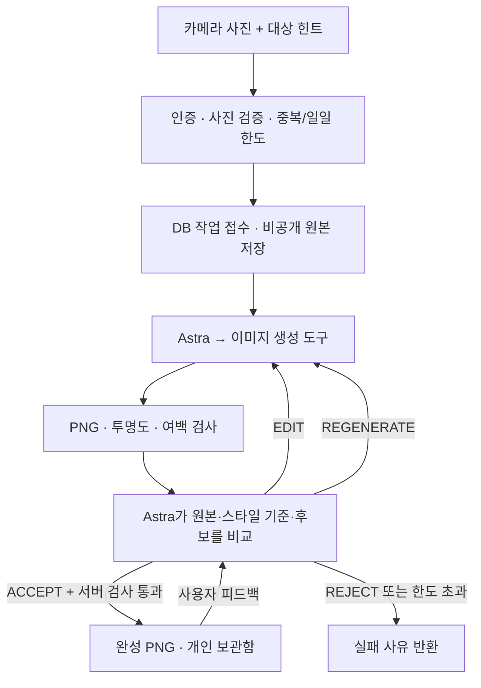

# 사진으로 내 가구 만들기 — 서버 구현 계약

카메라 사진에서 가구 하나를 골라 Rougether 스타일의 투명 PNG로 만들고 개인 보관함에 지급합니다. Astra가 생성 도구를 호출하고 별도의 이미지 검수에서 유지·부분 수정·전체 재생성·거절을 판단합니다. 사용자 피드백도 먼저 검수에 전달합니다.

신규 API의 구현 계약이며 `rougether-spec` 동기화 대상입니다. 기존 상점·보관함·방 배치 계약은 유지합니다. 관리자 Asset Foundry의 수동 승인 상태와 별개로 동작합니다. 기본 설정은 비활성이며 이 변경 자체로 운영 기능이 켜지지 않습니다.



## 입력과 결과

- 입력: 실제로 디코딩 가능한 JPEG/PNG, 최대 10MiB, 가로·세로 32~8192px, 총 3,200만 픽셀 이하. HEIC는 모바일에서 JPEG/PNG로 변환해 전송해야 합니다.
- 카메라 JPEG의 EXIF 회전/반전을 적용하고 최대 변 1536px 이하로 축소합니다. PNG로 재인코딩해 EXIF·GPS·텍스트 metadata를 제거한 사본만 보관하고 모델로 전송합니다.
- 한 사진당 가구 하나를 만듭니다. `targetHint`가 없으면 가장 두드러진 앞쪽 가구를 선택하도록 요청합니다. 원본에 가구가 없거나 구분할 수 없으면 검수에서 거절할 수 있습니다.
- 스타일 기준은 서버가 설정한 기존 가구 PNG 1~3개입니다. 기본값은 `items/cozy-developer-room/furniture/cozy-developer-room-cozy-chair.png`입니다. 사용자가 임의 URL·S3 key·모델·프롬프트 정책을 지정할 수 없습니다.
- 최종 출력은 1024×1024 PNG입니다. 서버는 알파 채널, 투명 픽셀 10% 이상, 가시 픽셀 1% 이상, 모든 테두리 8px 여백을 검사합니다. 이 검사는 최소 기술 조건이며 형태·색·스타일 품질은 Astra가 비교합니다. Astra의 ACCEPT가 서버 검사를 무효화할 수 없습니다.
- 검수에는 후보를 밝은/어두운 배경에 합성한 미리보기 2장을 보냅니다. 실제 사진 실험에서 비전 모델이 투명 픽셀의 숨겨진 RGB를 배경 번짐으로 오판한 사례를 확인해, 사람이 앱에서 보는 합성 결과와 검수 입력을 맞췄습니다. 저장되는 투명 PNG는 변경하지 않습니다.
- 완성 가구는 비활성 `photo_furniture` 테마 아래 비활성 아이템으로 생성합니다. 기존 보관함은 비활성 아이템도 반환하므로 `/api/v1/me/items`와 기존 방 배치 API를 그대로 사용합니다. 상점·뽑기에 자동 공개하거나 코인·다이아를 차감하지 않습니다.

## API

모든 경로는 JWT 인증이 필요합니다. 사용자 식별자는 JWT에서만 가져옵니다. 다른 사용자의 작업 조회·피드백은 404이며 탈퇴 사용자는 401입니다. 응답에는 원본·검수 전 후보 key, 사진, 피드백 원문, lease token을 포함하지 않습니다. 캐시는 `no-store`입니다.

| 경로 | 요청 | 응답 |
|---|---|---|
| `POST /api/v1/me/furniture-generations` | multipart `requestId`(UUID), `photo`(파일), `targetHint`(선택, 120자 이하) | 202, `Location`에 상태 조회 경로 |
| `GET /api/v1/me/furniture-generations` | 없음 | 최근 20개 `{ items: [...] }` |
| `GET /api/v1/me/furniture-generations/{id}` | 작업 UUID | 작업 상태 |
| `POST /api/v1/me/furniture-generations/{id}/feedback` | JSON `requestId`(UUID), `feedback`(1~500자) | 202, 재검토 상태 |

접수 예시:

```bash
curl -X POST "$API_BASE/api/v1/me/furniture-generations" \
  -H "Authorization: Bearer $ACCESS_TOKEN" \
  -F "requestId=$(uuidgen)" \
  -F 'targetHint=사진 맨 앞의 파란 의자' \
  -F 'photo=@/absolute/path/chair.jpg;type=image/jpeg'
```

성공 상태 예시:

```json
{
  "id": "11111111-1111-4111-8111-111111111111",
  "status": "SUCCEEDED",
  "action": "REVIEW",
  "assetKey": "items/photo-furniture/furniture/22222222-2222-4222-8222-222222222222.png",
  "userItemId": 77,
  "imageAttempts": 1,
  "reviewAttempts": 1,
  "decision": "ACCEPT",
  "reason": "원본 의자의 형태와 색상이 유지되고 배경이 제거되었습니다.",
  "failureCode": null,
  "expiresAt": "2026-09-07T03:00:00Z",
  "createdAt": "2026-09-06T03:00:00Z",
  "updatedAt": "2026-09-06T03:01:00Z"
}
```

`status`: `UPLOADING` → `QUEUED` ↔ `PROCESSING` → `SUCCEEDED` 또는 `FAILED`. `action`은 현재/다음 단계 `GENERATE`, `REVIEW`, `EDIT`, `REGENERATE`입니다. 프론트는 2~3초 간격으로 상태를 조회하고 terminal 상태에서 멈춥니다. 완료되면 보관함을 다시 조회합니다.

같은 사용자·`requestId`·사진·대상 힌트는 하나의 작업을 반환합니다. 같은 ID에 다른 내용을 보내면 `FURNITURE_REQUEST_CONFLICT`(409)입니다. 사진의 파일명·Content-Type 표기는 중복 판정에 쓰지 않습니다. 새 작업 UUID는 재전송할 때 유지해야 합니다.

피드백은 성공한 작업에만 허용됩니다. 먼저 `REVIEW`를 실행하고 Astra가 유지할지 수정할지 결정합니다. 수정본이 다시 통과하면 기존 `userItemId`의 에셋을 원자적으로 교체합니다. 아이템을 중복 지급하지 않으며 기존 방 배치 위치도 바뀌지 않습니다. 피드백 처리 중이거나 수정에 실패하면 직전 성공 결과를 유지하므로 `FAILED` 응답에도 기존 `assetKey`/`userItemId`가 있을 수 있습니다. 피드백 ID도 작업 내에서 멱등입니다.

주요 접수 오류는 `FURNITURE_GENERATION_UNAVAILABLE`(503), `FURNITURE_PHOTO_INVALID`(400), `FURNITURE_JOB_IN_PROGRESS`(409), `FURNITURE_DAILY_LIMIT`(429), `FURNITURE_SOURCE_EXPIRED`(410), `FURNITURE_BUDGET_EXHAUSTED`(409)입니다.

작업의 `failureCode`는 `PHOTO_REJECTED`, `HARD_QA_REJECTED`, `GENERATION_BUDGET_EXHAUSTED`, `PROVIDER_AUTH_FAILED`, `PROVIDER_RATE_LIMITED`, `PROVIDER_REQUEST_FAILED`, `PROVIDER_RESPONSE_INCOMPLETE`, `INVALID_IMAGE_OUTPUT`, `INVALID_REVIEW_OUTPUT`, `IMAGE_GENERATION_REFUSED`, `SOURCE_UPLOAD_FAILED`, `STORAGE_OR_PROCESSING_FAILED`, `WORKER_INTERRUPTED`, `UPLOAD_INTERRUPTED`, `SOURCE_EXPIRED`, `OWNER_WITHDRAWN`, `RESULT_CHANGED_EXTERNALLY` 등 안전한 분류 코드입니다. 공급자의 원본 오류 본문은 노출하지 않습니다.

## 호출 한도와 정합성

- 기본 한도: 사용자당 KST 하루 새 작업 2개, 동시 진행 1개, 작업 전체 이미지 호출 3회·검수 6회. 사용자 피드백도 같은 한도를 소비하며 횟수를 초기화하지 않습니다. 초기 업로드/외부 장애 실패도 새 작업 한도에 포함합니다.
- 생성은 Astra `gpt-6-astra`의 Responses API에서 `gpt-image-2` 이미지 도구를 최대 1회 호출하도록 요청합니다. 1024×1024·medium·투명 PNG이며 생성/검수의 mainline `max_output_tokens`는 각각 2048입니다. 검수 요청에는 도구를 넣지 않고 엄격한 JSON schema를 사용합니다.
- 이미지당 실제 요금은 모델·입출력에 따라 달라집니다. DB의 호출 횟수와 공급자가 보고한 최상위 입력/출력 토큰은 운영 진단용이며 확정 청구액이 아닙니다.
- 호출 수와 lease를 먼저 짧은 트랜잭션에서 예약합니다. 모델·S3 호출 중 DB 연결/행 잠금을 유지하지 않습니다. 사용자 행 → 작업 행 순서로 잠그며 `leaseToken`과 기한을 확인한 결과만 적용합니다.
- 공급자·네트워크 오류를 HTTP 클라이언트 내부에서 자동 재호출하지 않습니다. 180초 타임아웃에 60초 여유를 둔 lease가 만료되면 `WORKER_INTERRUPTED`로 종료합니다. 처리 여부가 불확실한 유료 요청을 재시작 시 다시 전송하지 않습니다.
- 마스터 아이템 생성·보관함 지급·작업 성공은 한 트랜잭션입니다. 수정 연결은 기존 asset key 조건의 DB CAS를 사용합니다. 관리자가 이미 바꾼 에셋을 오래된 결과로 덮어쓰지 않습니다. 늦게 도착한 워커 결과도 지급할 수 없습니다.
- 만료/탈퇴 정리 작업은 기능 접수를 꺼도 계속 실행됩니다. 생성용 scheduler와 기존 애플리케이션 scheduler를 분리하며, 모델 호출은 인스턴스당 한 단계씩 처리합니다. DB 선점은 여러 인스턴스에서도 동일 작업의 중복 실행을 막습니다.

## 저장과 배포 설정

- 원본/후보: `private/furniture-generation/{jobId}/{source|candidate}/{uuid}.png`. 공개 CDN의 허용 prefix에 추가하지 않습니다.
- 성공 결과: `items/photo-furniture/furniture/{uuid}.png`. 기존 key를 덮어쓰지 않습니다. 피드백 수정 후에도 이전 공개 결과 파일은 캐시/과거 참조를 위해 보존합니다.
- 사진 보관 기한은 접수 후 24시간입니다. 기한 이후 피드백을 받지 않고 원본·후보·피드백 원문·대상 힌트를 정리합니다. 탈퇴 감지 시에도 다음 정리 주기(기본 60초)에 원본을 정리합니다. S3 버전 관리가 켜져 있어도 임시 사진의 모든 버전과 delete marker를 제거합니다.
- DB와 연결되지 않은 임시 사진은 S3 lifecycle로 추가 회수합니다. lifecycle은 날짜 단위로 지연될 수 있어 정상 삭제 경로를 대체하지 않습니다. 공개 결과 연결 실패 시에는 DB 참조를 다시 확인한 뒤 best-effort로 삭제하고, DB 확인도 실패하면 보존합니다.
- `V63__add_furniture_generation_jobs.sql`은 작업/피드백 테이블과 전용 테마를 추가합니다. 머지 전에 최신 main의 Flyway 버전 충돌을 확인해야 합니다.

기존 `LLM_API_KEY`와 `LLM_BASE_URL`을 재사용합니다. 키를 새로 발급하거나 프론트에 전달하지 않습니다.

| 환경변수 | 기본값 |
|---|---|
| `FURNITURE_GENERATION_ENABLED` | `false` |
| `FURNITURE_GENERATION_WORKER_ENABLED` | `true` — 원본 정리도 포함하므로 중지 시 주의 |
| `FURNITURE_GENERATION_MODEL` | `gpt-6-astra` |
| `FURNITURE_GENERATION_IMAGE_MODEL` | `gpt-image-2` |
| `FURNITURE_GENERATION_TIMEOUT` | `180s` |
| `FURNITURE_GENERATION_MAX_IMAGE_ATTEMPTS` | `3` (허용 1~5) |
| `FURNITURE_GENERATION_MAX_REVIEW_ATTEMPTS` | `6` (허용 1~10) |
| `FURNITURE_GENERATION_DAILY_LIMIT` | `2` (허용 1~20) |
| `FURNITURE_GENERATION_STYLE_REFERENCE_KEYS` | 기존 개발자 방 의자 key, 쉼표로 최대 3개 |

활성화 전 순서는 다음과 같습니다.

1. 기존 서버 키의 Astra/이미지 모델 접근과 기준 에셋 존재를 확인합니다.
2. Terraform 변경으로 private prefix 쓰기·읽기·모든 버전 삭제, 스타일/완성 가구 읽기, 임시 사진 lifecycle을 반영합니다. `asset_allowed_prefixes`를 별도로 재정의하는 환경은 새 private prefix도 포함해야 합니다.
3. 서버를 배포해 migration을 적용합니다.
4. 서버의 기존 runtime env에 `FURNITURE_GENERATION_ENABLED=true`를 설정하고 user-api를 재시작합니다. 기존 배포 경로가 전달하는 `LLM_API_KEY`를 사용합니다.
5. 모바일이 카메라 사진 변환·multipart 업로드·상태 조회·피드백을 연결합니다. 이 서버 변경에는 모바일 화면이 포함되지 않습니다.

## 검증

```bash
./gradlew test
git diff --check
bash .github/scripts/test-asset-privacy.sh
terraform fmt -check deploy/terraform/ec2/assets.tf deploy/terraform/ec2/main.tf deploy/terraform/ec2/variables.tf
```

일반 테스트는 유료 API를 호출하지 않습니다. `FurnitureGenerationLiveSmokeTest`는 `FURNITURE_LIVE_SMOKE=true`일 때만 실행합니다. 기존 `LLM_API_KEY`가 안전하게 환경변수로 전달된 상태에서 아래 경로를 지정합니다. 테스트는 임시 MySQL과 메모리 S3를 사용하고 생성 결과만 지정한 로컬 폴더에 기록합니다. 운영 데이터는 변경하지 않습니다.

```bash
FURNITURE_LIVE_SMOKE=true \
FURNITURE_LIVE_PHOTO=/absolute/path/chair.jpg \
FURNITURE_LIVE_REFERENCE=/absolute/path/rougether-style.png \
FURNITURE_LIVE_OUTPUT=/absolute/path/local-results \
./gradlew :user-api:test --tests '*FurnitureGenerationLiveSmokeTest'
```

파일은 실제 OpenAI API로 전송되고 생성 최대 3회와 검수 비용이 발생합니다. 결과는 `result.json`, 시도별 `candidate-*.png`, 성공 시 `furniture.png`입니다. 공급자 실패나 검수 미통과를 테스트 성공으로 보고하지 않습니다.

기존 실제 생성물로 검수 변경만 확인하려면 `FURNITURE_LIVE_CANDIDATE=/absolute/path/candidate.png`도 설정합니다. 이 모드에서는 이미지 생성 호출을 하지 않고 저장된 후보 1개를 재생한 뒤 실제 검수와 DB 지급 경로를 실행합니다. 추가 이미지가 필요하다는 판정이면 실패로 종료합니다. `mode.txt`에 검증 모드를 구분하며 `stages.jsonl`에 단계별 결과, 성공 시 밝은/어두운 배경 미리보기도 저장합니다.

### 2026-09-06 실사진 검증

사용자가 승인한 사무용 의자 사진과 기존 Rougether 의자 에셋을 기존 서버 키로 전송했습니다. 실제 이미지 생성은 총 3회, 실제 검수는 총 4회였습니다.

- 첫 실행은 투명 PNG를 그대로 검수에 전달해 숨겨진 RGB를 배경 번짐으로 오판했고, 3회 생성 한도에서 `GENERATION_BUDGET_EXHAUSTED`로 종료했습니다. 무한 재호출 없이 중단되는 것도 확인했습니다.
- 검수 입력을 밝은/어두운 배경의 실제 알파 합성 결과로 수정했습니다. 첫 번째 실제 생성 후보를 재사용하고 추가 이미지 생성 없이 검수 1회만 실행해 `ACCEPT`를 받았습니다.
- 수정된 검수와 서버의 PNG 검사를 통과한 후보가 테스트 MySQL에서 `SUCCEEDED`가 되고 `userItemId`를 지급받았습니다. 이 재검증은 생성 단계를 저장된 후보로 재생한 것이며, 수정 이후 새 사진 생성부터 다시 실행한 검증은 아닙니다.
- 운영 DB·S3는 변경하지 않았습니다. 원본 PNG, 밝은/어두운 미리보기, 상태와 검증 모드 기록은 로컬 산출물로 보관했습니다. 실제 이미지 품질 검증 범위는 이 의자 사진 1장입니다.

공급자 계약 근거: [Astra 모델](https://developers.openai.com/api/docs/models/gpt-6-astra), [이미지 생성/수정](https://developers.openai.com/api/docs/guides/image-generation), [Structured Outputs](https://developers.openai.com/api/docs/guides/structured-outputs).
