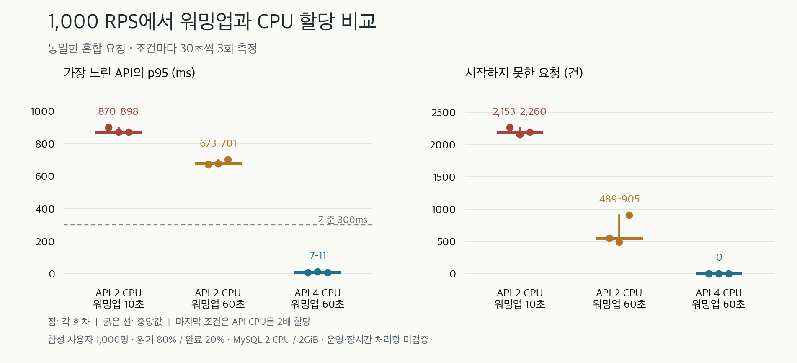

# 로컬 부하 실험: 부하 초반 대기와 CPU 할당

2026-09-10 실측. **API 4 CPU 조건에서 혼합 1,000 RPS를 30초씩 3회 통과했다.** 동일한 DB·메모리·입력에서 API 2 CPU 조건은 3회 모두 요청 누락과 지연 기준을 넘었다. 실험 도구와 낮은 부하의 API/DB 정합성 검증(Stage A)은 완료했다. 장시간 용량, 큰 데이터에서의 용량, 다중 인스턴스, Kubernetes 및 운영 트래픽은 후속 검증 대상이다.

## 고정한 조건

- 애플리케이션 소스: main `fbd461546df2442e618c7b7bc86a488bd7ee0d9b`. 분리된 `codex/scale-engineering` 작업 공간에서 실행했다. 애플리케이션 코드는 수정하지 않았다.
- JAR SHA-256: `f397889a244376d67ee396922013ca49635b0582212f13551c4223d61c482dec`.
- Docker Desktop: aarch64, 12 CPU, 메모리 8,217,165,824 bytes. 장비 RAM 48GB와 Docker VM 할당량은 다르다.
- API: 1개, 컨테이너 2GiB, 힙 1GiB. MySQL: 2 CPU, 2GiB, buffer pool 1GiB, 영속 볼륨, `innodb_flush_log_at_trx_commit=1`, `sync_binlog=1`.
- Hikari 최대 연결 10개. 합성 사용자 1,000명, 오늘 마감인 투두 10,000건. 루틴·온보딩·과거 완료 이력은 없는 최소 fixture다.
- `/me` 40%, `/today` 40%, 투두 완료 20%. 실제 JWT 검증과 DB commit을 통과한다. OAuth 로그인·AI 호출은 부하에 포함하지 않는다.
- k6 500 VU 고정, 1 iteration = 1 HTTP 요청, 유입 1,000 RPS, 측정 30초. 측정 전 읽기 100 RPS로 10초 또는 60초 warmup을 수행한다. 혼합 업무 전체가 충분히 예열됐다는 뜻은 아니다.
- JFR profile, 발생기·컨테이너 CPU/RSS, JVM/Hikari, 서버 처리 카운터, DB SQL digest와 최종 업무 상태를 같은 조건에서 수집한다.

## 반복 비교

표의 범위는 3회 중 최솟값~최댓값이며 신뢰구간이 아니다. 마지막 조건은 API CPU를 2배 할당한 **자원 증설 비교**다.

| API CPU / 읽기 warmup | API별 p95 중 최댓값 | 시작하지 못한 요청 | 통과 |
| --- | ---: | ---: | ---: |
| 2 CPU / 10초 | 870~898ms | 2,153~2,260건 | 0/3 |
| 2 CPU / 60초 | 673~701ms | 489~905건 | 0/3 |
| 4 CPU / 60초 | 7~11ms | 0건 | 3/3 |



정상 용량의 기준은 실제 요청 ≥ 계획의 99%, `dropped_iterations=0`, 업무 성공률 ≥ 99.9%, 예상하지 않은 오류 ≤ 0.1%, API별 p95 ≤ 300ms / p99 ≤ 1초, 최종 DB 대조 통과다. 빠른 409·429·503을 성공 처리량으로 세지 않는다.

아래 p95/p99는 **전체 요청의 지연**이다. 위 표와 그래프는 API별 p95의 최댓값이므로 수치가 다르다.

| API CPU / warmup / 회차 | 실제 요청 / 계획 | 누락 | 전체 p95 / p99 |
| --- | ---: | ---: | ---: |
| 2 / 10초 / 1 | 27,741 / 30,000 | 2,260 | 862 / 1,147.8ms |
| 2 / 10초 / 2 | 27,848 / 30,000 | 2,153 | 851 / 1,183.5ms |
| 2 / 10초 / 3 | 27,809 / 30,000 | 2,192 | 842 / 1,151.8ms |
| 2 / 60초 / 1 | 29,449 / 30,000 | 552 | 649 / 896ms |
| 2 / 60초 / 2 | 29,511 / 30,000 | 489 | 645 / 916.9ms |
| 2 / 60초 / 3 | 29,096 / 30,000 | 905 | 675 / 1,051.2ms |
| 4 / 60초 / 1 | 30,001 / 30,000 | 0 | 5 / 146ms |
| 4 / 60초 / 2 | 30,001 / 30,000 | 0 | 6 / 131ms |
| 4 / 60초 / 3 | 30,001 / 30,000 | 0 | 5 / 120ms |

k6의 도착 시점 경계에서 한 건이 더 시작될 수 있어 발생량 대조는 ±1건을 허용한다. 전송된 요청은 9회 모두 업무 응답에 성공했지만, 2 CPU 회차는 누락과 지연 때문에 실패했다.

## 보상 정합성

4 CPU 회차마다 투두 6,000건이 완료됐고 코인 50,000개가 지급됐다. 사용자 1,000명의 일일 코인 상한 50 때문에 완료 1,000건은 지급액이 0이다. 완료 요청 처리량과 코인이 지급된 요청 수를 구분한다.

세 회차 모두 완료 ID·소유자, 사용자별 코인 지갑·원장·개인 방 성장, 중복 원장 여부가 예상 상태와 일치했다. 별도 중복 요청 시험에서도 같은 투두 5건에 요청을 집중했을 때 최종 완료 5건·코인 50개만 반영됐다. 나머지 예상 409는 업무 성공량에서 제외했다.

누락 회차의 DB 감사는 전체 계획 대조를 미확정으로 둔다. 예상값을 0으로 가정해 정상 지급된 보상을 데이터 손상으로 표시하지 않는다. 독립적으로 확인할 수 있는 소유권·중복 원장 검사와 계획 전체의 일치 여부를 구분한다.

## 병목 가설과 선택

2 CPU 반복 회차에서는 Hikari 대기가 초반 186~189개 수준까지 늘고 후반에는 거의 사라졌다. 읽기 warmup 60초 조건의 커넥션 획득 누적 대기 시간은 약 1,795~2,053초였다. 여러 요청의 대기 시간을 합한 값이므로 시험의 경과 시간 30초보다 클 수 있다.

앞선 탐색에서 같은 구간에 API CPU가 2 CPU 제한에 도달했고, JFR의 긴 JIT 컴파일 이벤트도 혼잡 구간과 겹쳤다. 해당 탐색의 DB row lock wait, log wait, buffer pool disk read 증가량은 0이었다. pool만 10→20으로 늘린 한 회차도 개선되지 않았다(누락 3,192건, 전체 p95 987ms). 단일 회차이므로 pool 증가가 성능 저하를 유발했다고 확정하지 않는다.

4 CPU 반복 회차에서는 커넥션 획득 누적 대기가 약 63~89초로 줄었다. 주기적으로 관찰한 pending 값은 모두 0이었지만, 누적 대기가 남으므로 순간적인 대기가 전혀 없었다고 해석하지 않는다. 발생기 CPU 관측 최댓값은 59.7~74.1%였다(`ps` 기준 약 한 코어 이하).

이 증거는 **이 조건에서 API CPU 제한이 혼합 부하 초반 지연에 영향을 줬음**을 뒷받침한다. JIT만을 유일한 원인으로 확정하거나, 2 CPU의 충분히 예열된 지속 처리량을 측정했다고 주장하지 않는다.

선택한 순서는 pool 증가 탐색 → 동일 자원에서 읽기 warmup 비교 → API CPU만 증설한 비교다. 관찰된 병목을 먼저 확인하기 위해 Redis·Kafka·샤딩은 아직 추가하지 않았다. 다음 비교는 같은 전체 CPU 예산의 단일·다중 API, 신규 인스턴스 유입 제어, 충분히 예열된 장시간 부하다.

## 재현과 증거

```bash
# JAR를 먼저 빌드한 뒤 아래 조건마다 독립 회차를 실행한다.
./gradlew --no-daemon :user-api:bootJar
for repeat in 1 2 3; do
  for warmup in 10 60; do
    SCALE_API_CPUS=2 bash qa/scale/run-local.sh mixed --rate 1000 --duration 30 --users 1000 --todos 10000 --vus 500 --warmup "$warmup" --skip-build
  done
done
for repeat in 1 2 3; do
  SCALE_API_CPUS=4 bash qa/scale/run-local.sh mixed --rate 1000 --duration 30 --users 1000 --todos 10000 --vus 500 --warmup 60 --skip-build
done
```

첫 루프의 예상 실패 종료 코드를 전체 스크립트의 오류로 중단시키지 않는 셸에서 실행한다. 추가 `SCALE_*` 환경 변수가 있다면 고정 조건과 맞는지 manifest로 확인한다.

[정량 증거 JSON](2026-09-10-comparison.json)에 9회 전체의 run ID, 소스·JAR·실험 도구 hash, 실제 컨테이너 이미지 digest·아키텍처·자원, 요청 지표, 최종 감사, 원시 파일 SHA-256을 담았다. JWT와 개별 fixture 행은 제외했다. 원시 자료는 Git에서 제외한 `qa/scale/results/<run-id>/`에 보존한다.

- `validation-20260910T002446`: API 2 CPU, warmup 10/60초를 번갈아 각 3회 실행.
- `cpu-validation-20260910T003546`: API 4 CPU, warmup 60초를 3회 실행.
- `20260909T235718-086d2f-mixed`: 최초 1,000 RPS 실패 및 프로파일.
- `20260910T000545-60545b-mixed`: pool 20의 단일 탐색.
- `20260910T000223-f15977-contention`: 중복 완료 100 RPS, 3,001회 요청 중 완료 5건·예상 409 2,996건.

## 검증 범위와 다음 과제

실제 API로 읽기·혼합·쓰기·중복 완료의 회귀 검사를 통과했다. 검사기는 잘못된 응답, 원장 불일치, 전송량 부족, 요청 누락, 성공 응답만 빠른 경우, 관측 자료 누락을 차단하는 음성 대조 테스트를 갖췄다. 짧은 회귀 시험은 관측 샘플이 부족하면 `capacity_unverified`로 분류한다.

다중 API 실험에서는 현재 compose처럼 furniture worker·billing worker·bots를 명시적으로 끈다. 현재 user-api에는 기본 활성 scheduler가 있으며 일부 작업의 DB lock·lease가 모든 외부 호출/장애 상황의 안전성을 보장하는 것은 아니다.

현재 `/api/v1/health`의 단순 정상 응답과 트래픽을 감당할 준비는 별도 조건이다. Kubernetes 단계에서는 startup/readiness, 새 Pod에 대한 초기 유입, 종료 중 요청 처리, 잘못된 배포의 복구를 각각 시험한다. 현재 소스에서 해당 probe와 종료 시간 설정을 명시한 Kubernetes manifest는 확인되지 않았다. 프레임워크의 실제 종료 동작도 실험에서 확인해야 한다.

이번 수치는 같은 맥북의 발생기·API·DB, 작은 데이터, HTTP loopback, 30초 구간에서 얻은 합성 실험이다. 소수 반복과 다른 앱의 자원 사용, 호스트 캐시·열 상태를 완전히 통제하지 못했다. 100,000 read / 30,000 mixed / 10,000 write RPS 및 장시간·독립 노드 장애는 여전히 도전 목표다.

## 확장 탐색: 사용자 2만 명, 혼합 3,000 RPS

후속 탐색은 사용자 20,000명·투두 60,000건(사용자당 3건), 5,000 VU, API 4 CPU / DB 2 CPU, 읽기 warmup 60초로 실행했다. 사용자·투두·VU가 앞의 비교와 다르므로 동일 데이터에서 RPS만 높인 전후 비교로 해석하지 않는다. 이 조건에서는 완료 요청마다 코인이 지급된다.

첫 시도 `20260910T004202-d68670-mixed`는 측정 전에 warmup 프로세스가 105초 시간 제한에 걸렸다. `SharedArray` 밖의 사용자 전체 검증이 VU마다 반복되는 O(VU × 사용자 수) 비용을 발견했다. 같은 검증을 공유 배열 초기화 안으로 옮겨 한 번만 수행하게 했다. 빈 토큰·불연속 ID는 계속 차단한다. HTTP 없는 별도 합성 fixture control(20,000명 / 5,000 VU)은 약 0.4초에 초기화와 10,000개 검사를 마쳤다. 서로 다른 작업을 재므로 105초→0.4초의 서버 성능 개선률로 계산하지 않는다.

수정 뒤 실제 fixture로 다시 실행한 `20260910T004906-dbc5de-mixed`는 읽기 warmup 6,000회, 누락 0, p95 23ms로 준비를 마쳤다. 이후 본부하는 다음과 같이 **실패**했다.

| 계획 / 실제 전송 / 미시작 | 전체 p95 / p99 | 관찰된 완료 / 코인 |
| --- | --- | --- |
| 90,000 / 57,553 / 32,448건 | 4,275 / 4,432ms | 11,510건 / 115,100개 |

전송된 요청의 업무 응답 성공률은 100%였지만 목표 유입량과 지연 기준에 미달했다. 관찰된 중복 원장·소유권 불일치는 0건이며, 요청 누락 때문에 전체 계획에 대한 정합성 감사는 통과시키지 않았다. 10,000 RPS로의 증가는 중단했다.

Hikari 획득 대기 누계는 약 6,025초였고, pending 189개 및 DB CPU 약 202%(2 CPU 제한)를 관찰했다. API CPU는 관찰 시점에 약 292~342%였다. DB row lock wait/time, buffer pool disk read, log wait의 전후 증가량은 0이었다. `/today` SQL 평균은 약 0.16ms, 평균 검사 6행 / 반환 3행이었고 COMMIT은 69,821회·평균 약 1.36ms였다. 많은 짧은 DB 작업과 연결 대기를 다음 병목 후보로 본다.

**관측 샘플이 2개뿐이므로 DB가 계속 포화됐는지, 초반에만 몰렸는지는 확정하지 않는다.** 관리 API를 순차 조회하는 관측 자체도 부하의 영향을 받는다. 후속 단계는 업무 요청 대기열에 덜 영향을 받는 JVM/DB 관측을 확보하고, 같은 확장 fixture에서 DB 자원·연결 예산을 한 가지씩 비교하는 것이다.

[확장 회차 증거 JSON](2026-09-10-expansion.json)에 조건·원시 파일 hash·최종 감사·측정 한계를 보존했다.

```bash
SCALE_API_CPUS=4 bash qa/scale/run-local.sh mixed --rate 3000 --duration 30 --users 20000 --todos 60000 --vus 5000 --warmup 60 --skip-build
```

최종 검증: Python unit 52개, k6 응답 계약 12개, fixture 초기화의 잘못된 입력 및 VU>사용자 수 경계 검사 통과. 실행한 실험의 컨테이너·볼륨·네트워크·부하 프로세스가 남지 않은 것을 확인했다. 유료 원격 자원은 생성하지 않았다.

차트는 `matplotlib`이 설치된 Python에서 `python3 qa/scale/reports/plot-comparison.py`로 증거 JSON을 읽어 다시 생성할 수 있다. 기본 한글 폰트는 macOS의 Apple SD Gothic Neo다.
